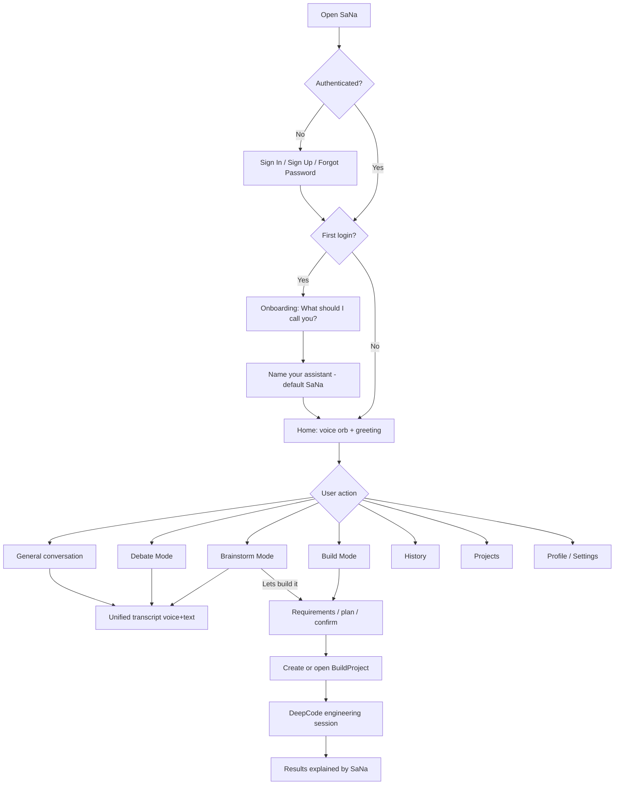
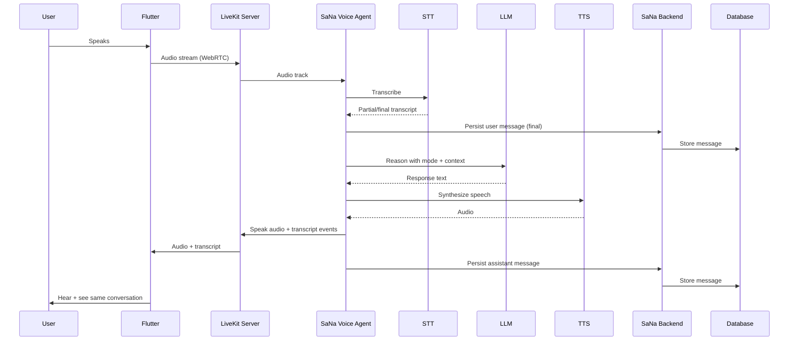
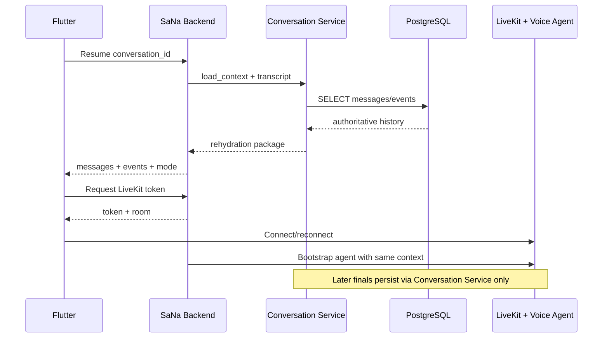
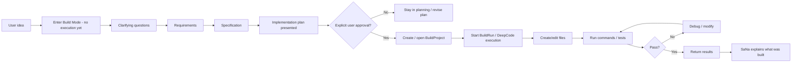
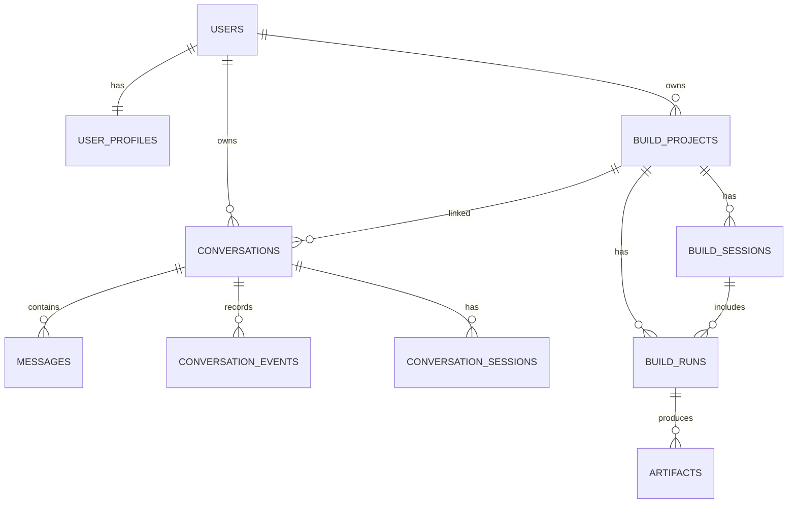

# SaNa — Product Requirements Document (PRD)

**Status:** Architecture/MVP decisions approved — awaiting go-ahead to implement  
**Product:** SaNa  
**Document version:** 0.3.0  
**Date:** 2026-08-08  
**Audience:** Founder + future implementers (beginner-friendly)

---

## Approved architecture decisions (2026-08-08)

The following decisions are **APPROVED** for architecture and MVP. Implementation must not begin until the founder explicitly gives a go-ahead after reviewing this updated PRD.

| # | Decision | Status | Notes |
|---|---|---|---|
| 1 | Backend: **Python + FastAPI** | **APPROVED** | Central SaNa Backend |
| 2 | Auth/DB: **Supabase Auth + Supabase PostgreSQL** | **APPROVED** | Keep boundaries clean; avoid unnecessary Supabase lock-in |
| 3 | Flutter state: **Riverpod** | **APPROVED** | |
| 4 | Voice transport: **LiveKit** | **APPROVED** | |
| 5 | Voice agents: **LiveKit Agents** | **APPROVED** | |
| 6 | Dev LLM: **OpenRouter free + optional Ollama** | **APPROVED** | Provider-independent; do not hard-code one free model forever |
| 7 | DeepCode MVP: **DeepCodeAdapter** around verified CLI/JSON | **APPROVED WITH VERIFICATION REQUIRED** | Verify commands/flags/JSON/session behavior before implementing adapter body |
| 8 | Build MVP location: **Local trusted workspaces on PC** | **APPROVED FOR DEV/MVP** | Must be swappable later for sandboxed remote workers |
| 9 | Mode switching: **Same conversation** | **APPROVED** | Store mode changes as metadata/events |
| 10 | Voice stack: **C — Hybrid** | **APPROVED** | Prefer free/local when practical; substitute hosted for natural realtime UX |
| 11 | Device testing: **Emulator + physical Android device** | **APPROVED** | Emulator for UI; physical device required for realtime voice validation |
| 12 | Git/GitHub: **Use existing repository** | **APPROVED** | Do not create a new repo; never commit secrets |
| 13 | Branding/orb direction | **APPROVED (initial, refinable)** | Dark-first, calm blue/teal glow, fluid state animations |

### Supabase boundary rule (approved)

- Use Supabase Auth for authentication.
- Use Supabase PostgreSQL as the primary database.
- Keep database/backend boundaries clean so SaNa is not unnecessarily locked into Supabase-specific features (prefer standard Postgres + portable repository interfaces).

### DeepCode verification gate (approved)

Before implementing the DeepCode adapter body:

1. Verify the actual installed DeepCode CLI commands.
2. Verify that `deepcode exec` / `deepcode loop` with `--json` is valid for the installed version.
3. Verify the actual JSON output/schema from real runs.
4. Verify session/project continuation behavior (`--resume`, workspace persistence).
5. Do **not** invent commands, flags, APIs, JSON structures, or endpoints.

Create the adapter **abstraction** so the rest of SaNa does not depend directly on the DeepCode CLI. Swap later without rewriting Build Mode core.

### Build workspace rule (approved)

- MVP builds run only in explicitly designated local project workspaces.
- Do **not** give DeepCode unrestricted access outside those workspaces.
- Architect Build Mode so local workspaces can later be replaced by isolated/sandboxed remote workers without rewriting SaNa’s core Build Mode.

### Git / secrets rule (approved)

- Use the existing GitHub repository; do not create a new one.
- Inspect existing repository/history before changes.
- Preserve current history and existing files.
- Create sensible commits/checkpoints as development progresses.
- Never commit API keys, `.env` secrets, Supabase secrets, OpenRouter keys, LiveKit secrets, or other credentials.
- Ensure sensitive files are covered by `.gitignore`.

**GitHub repository (resolved 2026-08-08):**  
[https://github.com/saisree510/SaNa-Voice-Intelligence.git](https://github.com/saisree510/SaNa-Voice-Intelligence.git)

- Existing product repo for SaNa — **do not create a new repository**
- Do **not** use upstream `HKUDS/DeepCode` as SaNa’s product repo
- Remote inspected as effectively empty (no commits yet)
- Local `SANA` workspace currently contains `PRD.md` and is not yet initialized as a git working tree linked to this remote
- Before implementation: initialize/link this local workspace to the existing remote, add `.gitignore`, and commit non-secret project files only after founder go-ahead

---

## How to read this document

This PRD explains **what SaNa is**, **how users experience it**, and **how the systems should fit together**.

Wherever a technology is recommended, this document explains:

- what it is
- why SaNa needs it
- what problem it solves
- where it runs
- how it communicates with other parts
- whether it is open-source
- whether it can be free during development
- whether it may cost money in production
- what alternatives exist

**Important principle:** if something was not verified in the current environment or official docs, it is labeled **TBD / Requires verification**. This PRD does **not** invent DeepCode REST endpoints or fictional SDKs.

---

## Table of contents

1. Product overview  
2. Problem statement  
3. Product vision  
4. Product principles  
5. Target users  
6. User personas  
7. Primary use cases  
8. MVP scope  
9. Non-goals  
10. Future scope  
11. Complete user journey  
12. Authentication flow  
13. Onboarding flow  
14. Home experience  
15. Voice interaction  
16. Text interaction  
17. Unified conversation model  
18. Conversation history  
19. General Mode  
20. Debate Mode  
21. Brainstorm Mode  
22. Build Mode  
23. DeepCode architecture  
24. Persistent Build Projects  
25. Build lifecycle  
26. Build status/progress  
27. LiveKit architecture  
28. STT architecture  
29. LLM architecture  
30. TTS architecture  
31. OpenRouter / local model strategy  
32. Ollama strategy  
33. Backend architecture  
34. Flutter architecture  
35. Database architecture  
36. Database schema  
37. API boundaries  
38. State management  
39. Memory architecture  
40. Security  
41. Build sandbox / security  
42. Error handling  
43. Offline / reconnection behavior  
44. Functional requirements  
45. Non-functional requirements  
46. Performance / latency expectations  
47. Testing strategy  
48. Prerequisite checklist  
49. Required accounts / API keys  
50. Free vs paid infrastructure  
51. Development phases  
52. MVP acceptance criteria  
53. Risks  
54. Technical unknowns  
55. Open questions  
56. Decisions that require approval  

---

## 1. Product overview

**SaNa** is a developer-focused **conversational intelligence** mobile app.

SaNa is:

- voice-first, but **not** voice-only
- conversation-first, but **not** “just a chatbot”
- an AI technical partner a developer can talk with naturally

SaNa helps developers:

- discuss coding problems
- learn technical concepts
- discuss AI and software engineering
- debate technical ideas
- brainstorm projects
- design software and architectures
- solve development problems
- **build actual software projects**
- continue improving previously created projects

### What SaNa is not

| Not this | Why |
|---|---|
| Just a chatbot | Modes, voice, persistence, and Build Mode make it a product |
| Just a voice assistant | Text and voice share one conversation |
| DeepCode itself | DeepCode is the engineering engine used by Build Mode |
| LiveKit itself | LiveKit is realtime communication infrastructure |

**Simple summary:**  
SaNa is the product experience. DeepCode is the builder. LiveKit is the realtime voice pipe.

---

## 2. Problem statement

Developers often bounce between:

- ChatGPT / Claude for thinking
- IDEs / coding agents for building
- notes apps for ideas
- separate voice tools that do not keep context

This creates friction:

1. Voice and text conversations are disconnected.
2. Brainstorming and building live in different tools.
3. Projects are hard to reopen and continue later.
4. Coding agents are powerful but not designed as a calm, mobile-first technical partner.

SaNa aims to unify:

**conversation + reasoning modes + engineering execution**

into one coherent mobile experience.

---

## 3. Product vision

SaNa should feel like:

> “A calm, premium AI technical partner in your pocket — one you can talk to, type to, debate with, brainstorm with, and eventually ask to build and evolve real software.”

Long-term vision:

- developers start ideas by speaking
- refine them through Debate / Brainstorm
- convert promising ideas into Build Projects
- continue those projects over days/weeks
- always keep one synchronized conversation transcript

---

## 4. Product principles

1. **Voice-first, not voice-only** — speaking and typing are equal interfaces to one conversation.
2. **One conversation model** — never separate “voice chats” and “text chats.”
3. **Modes, not separate apps** — General / Debate / Brainstorm / Build share one architecture.
4. **Prove layers independently** — do not build everything at once.
5. **Do not block Build Mode later** — early choices must leave room for DeepCode + sandboxes.
6. **Secrets never live in Flutter** — API keys stay on backend / local secure config.
7. **Prefer free/open during development** — without pretending local/open always means free hosted.
8. **Do not invent integrations** — verify DeepCode / LiveKit / provider capabilities before coding against them.
9. **Explain, don’t dump** — errors should be human-friendly; technical details optional.
10. **Teach while building** — architecture should stay understandable to a learning founder.

---

## 5. Target users

### Primary

- Indie developers / solo builders
- Students learning software engineering / AI
- Mobile-first developers who want to think out loud
- Builders who want an AI partner for ideation + implementation

### Secondary (later)

- Small engineering teams
- Mentors / tutors
- Hackathon builders

### Not initial target

- Enterprise compliance-first orgs
- Non-technical consumers wanting a general life assistant

---

## 6. User personas

### Persona A — “Sai, the learning builder”

- Learning Flutter + AI systems
- Wants to talk through ideas, not only type
- Has limited budget for APIs
- Wants to eventually build real apps with AI help

Needs:

- low-cost development stack
- clear explanations
- ability to reopen projects later

### Persona B — “Maya, the late-night debugger”

- Experienced developer stuck on architecture tradeoffs
- Wants Debate Mode to stress-test ideas
- Sometimes wants Build Mode to scaffold solutions

Needs:

- strong reasoning
- conversation history
- mode switching without losing context

### Persona C — “Leo, the idea machine”

- Generates many product ideas
- Needs Brainstorm Mode to structure them
- Wants “let’s build it” conversion into a project

Needs:

- idea organization
- conversion into Build Projects
- persistence across days

---

## 7. Primary use cases

1. Sign up / sign in securely
2. First-time onboarding (user name + assistant name)
3. Ask a technical question by voice
4. Continue the same conversation by typing
5. Browse and resume conversation history
6. Enter Debate Mode and challenge an idea
7. Enter Brainstorm Mode and expand a product idea
8. Convert a brainstorm into Build Mode
9. Create a Build Project via DeepCode (MVP: controlled local/dev workspace)
10. Reopen an existing Build Project and request changes
11. See human-friendly status during builds (only when backed by real state)
12. Recover gracefully from network / AI / microphone failures

---

## 8. MVP scope

MVP means: **a real usable Android prototype**, not production perfection.

### Finalized MVP scope (approved)

- Flutter Android app (emulator for UI; physical device required for voice validation)
- Supabase Auth + Supabase PostgreSQL (portable DB boundaries)
- Authentication (sign up / sign in / sign out / password reset / session persistence)
- First-time onboarding (user name + assistant name; speak or type)
- Home screen with SaNa voice orb + Debate / Brainstorm / Build cards
- Dark-first design system with refinable orb/branding tokens
- General conversation (text first, then voice)
- Unified voice + text conversation in the **same** conversation
- Mode changes stored as metadata/events inside that conversation
- Real-time transcription into the same transcript
- Persistent conversations + history + resume
- Debate Mode
- Brainstorm Mode
- Basic Build Mode with swappable execution backend
- DeepCodeAdapter abstraction + verified CLI/JSON POC (after verification gate)
- Simple Build Project persistence + reopen/continue
- Local trusted workspaces for builds (dev/MVP only)
- Hybrid voice stack interfaces (local preferred when practical; hosted substitutable)
- Provider-independent LLM layer (OpenRouter free default; Ollama optional)

### Explicitly deferred from MVP

- Production-grade multi-tenant sandboxing / remote build workers
- GitHub import/export of user projects
- APK/web preview hosting
- Deployment pipelines
- Collaborative multi-user projects
- Advanced long-term memory / RAG
- Custom voices / personalities marketplace
- Finalized brand identity lock
- iOS release polish

---

## 9. Non-goals

- Building a full IDE on the phone
- Running arbitrary AI-generated code on-device
- Tight coupling to one LLM vendor
- Storing raw microphone audio by default
- Fake “progress theater” not backed by real build events
- Replacing DeepCode’s own Desktop/CLI UX
- Building every mode as a separate product

---

## 10. Future scope (post-MVP)

- Production sandboxed Build Mode (containers / isolated workers)
- GitHub integration (import / export / PRs)
- Build previews (web/APK artifacts)
- Deployment helpers
- Collaborative projects
- Advanced long-term memory
- Advanced RAG over user projects/docs
- Multiple SaNa voices / personalities
- Project sharing
- Multi-agent engineering workflows
- iOS parity

---

## 11. Complete user journey



### Plain-English journey

1. You open SaNa.
2. If needed, you sign in.
3. First time: SaNa asks what to call you, then what to call itself.
4. Home appears with the voice orb and a greeting like: “Hey Sai, what are we working on today?”
5. You can talk normally, or choose Debate / Brainstorm / Build.
6. Whatever you say or type becomes one shared conversation.
7. If you build something, SaNa coordinates DeepCode to create/modify a project in a safe workspace.
8. Later, you can reopen that project and continue.

---

## 12. Authentication flow

### Screens (unauthenticated)

- Sign In
- Sign Up
- Forgot Password

### Supported actions

- Register
- Sign in
- Sign out
- Password reset
- Persistent login session
- Secure backend authentication

### Security rule

Flutter must **never** contain:

- OpenRouter keys
- LiveKit API secrets
- database service-role keys
- DeepCode credentials
- any server master secrets

Flutter may hold only **user session tokens** issued by the auth system.

### Approved approach

**Supabase Auth** + **Supabase PostgreSQL** for MVP (**APPROVED**).

| Topic | Detail |
|---|---|
| What it is | Managed auth + Postgres platform |
| Why SaNa needs it | Secure accounts without building auth from scratch |
| Problem solved | Sign-up, login, sessions, password reset, user IDs |
| Where it runs | Supabase cloud (or self-host later) |
| Communication | Flutter ↔ Supabase Auth SDK; Backend verifies JWT |
| Open-source? | Supabase stack is open-source; hosted service is commercial |
| Free for development? | Yes, generous free tier typically |
| Production cost? | May cost money as usage grows |
| Alternatives | Firebase Auth, Auth0/Clerk, custom FastAPI+JWT+Postgres |

**Boundary rule:** use standard Postgres schemas/repositories and keep SaNa Backend as the orchestration boundary so we are not unnecessarily locked into Supabase-only features.

---

## 13. Onboarding flow

Triggered only on **first successful sign-in** when profile is incomplete.

### Step 1 — User name

SaNa asks:

> “What should I call you?”

User may **speak or type**.

Example answer: `Sai`

Store as `user_profiles.display_name`.

### Step 2 — Assistant name

Allow naming the conversational intelligence.

Default: `SaNa`

Example:

- User name: Sai
- Assistant name: SaNa

Store as `user_profiles.assistant_name`.

### Returning users

Skip onboarding if profile already has required fields.

---

## 14. Home experience

After onboarding, open the primary conversation screen.

### Greeting example

> “Hey Sai, what are we working on today?”

### Primary visual

Centered **SaNa voice orb / logo**.

### Orb states

| State | Meaning |
|---|---|
| Idle | Ready, waiting |
| Connecting | Establishing LiveKit / agent session |
| Listening | Mic active, waiting for speech |
| User speaking | Speech detected |
| Processing / thinking | STT done / LLM working |
| SaNa speaking | TTS / agent audio playing |
| Reconnecting | Temporary network recovery |
| Error | Recoverable failure |

### Approved initial visual direction

SaNa should feel intelligent, calm, friendly, developer-focused, premium, and futuristic **without** excessive cyberpunk styling.

- Dark-first interface
- Deep navy / near-black background
- Subtle blue / indigo / teal / cyan gradients
- Soft glow rather than aggressive neon
- Fluid orb animation
- Different animation behavior for listening / thinking / speaking (not only color swaps)

The voice orb is the main visual identity. Branding is **not** over-finalized: design tokens for colors, gradients, and orb motion must remain refinable.

### Mode cards

1. Debate  
2. Brainstorm  
3. Build  

Users can also talk in **General Mode** without selecting a card.

### Navigation (minimal)

- Home
- History
- Projects
- Profile / Settings

### Device testing policy (approved)

- Start general Flutter UI development on the **Android emulator**
- Once microphone, LiveKit, STT/TTS, audio routing, permissions, interruption/barge-in, and realtime voice are introduced, also test frequently on a **physical Android device**
- Real voice UX cannot be validated adequately on emulator alone

---

## 15. Voice interaction

### Plain English

When you speak, your phone sends audio into a realtime session. A voice agent turns speech into text, thinks, speaks back, and the written transcript updates at the same time.

### Technical flow



### Requirements

- Microphone permission handling
- Secure LiveKit token generation on backend
- Connection / reconnection lifecycle
- User speech detection / assistant speech detection
- Interruptions / barge-in (where supported by LiveKit Agents)
- Partial + final transcripts
- Transcript synchronization with chat UI
- Natural error messaging on failures

---

## 16. Text interaction

Users can type at any time in the transcript view.

Typed messages:

- join the **same conversation**
- use the same mode / context loaded from PostgreSQL via Conversation Service
- are persisted like voice transcripts through the same Conversation Service
- may be answered by voice, text, or both depending on session state

### Typed turn path (FastAPI)

```text
Flutter typed message
  → SaNa Backend REST/SSE
    → Conversation Service
      → load conversation context from PostgreSQL (messages + recent events)
      → AI Orchestrator (current mode)
      → LLMProvider
      → persist assistant message (idempotent)
      → return/stream response to Flutter
```

MVP recommendation for simultaneous voice+text:

- If a LiveKit voice session is active, typed text should be injected into the same agent session when supported (**requires verification** of LiveKit Agents text-input path; Flutter starter docs indicate text input is supported), **and** still persisted through Conversation Service.
- If voice is inactive, text uses the FastAPI path above exclusively.

---

## 17. Unified conversation model

### Core rule

Voice and text are two interfaces to **one conversation**.

Example:

1. User speaks: “SaNa, explain what LangGraph does.”
2. Transcript shows user text.
3. SaNa answers by voice and text.
4. User types: “How is it different from CrewAI?”
5. SaNa continues with full prior context.

There are **not** separate voice conversation objects and text conversation objects.

### Authoritative persisted history

**PostgreSQL, accessed through SaNa’s Conversation Service, is the authoritative persisted conversation history.**

| Store | Role |
|---|---|
| PostgreSQL `messages` / `conversation_events` / `conversations` | **Source of truth** for durable history, resume, audit, and LLM context assembly |
| LiveKit room / agent in-memory state | Ephemeral realtime transport only |
| Flutter local UI state | Display/cache only; may be stale; must rehydrate from Conversation Service |

LiveKit must **not** be treated as the long-term conversation database.  
If LiveKit disconnects, the Conversation Service + PostgreSQL remain the truth.

### Shared context for voice and text turns

Both paths must resolve the same `conversation_id` and assemble context from the same Conversation Service:

```text
Shared context assembly (Conversation Service)
  1. Load conversation row (current mode, linked build project, etc.)
  2. Load recent messages (authoritative transcript)
  3. Load recent conversation_events (mode changes, build links, session transitions)
  4. Apply user preferences (display name, assistant name)
  5. Produce Mode-aware prompt/context package for LLM / voice agent
```

#### Voice turn path (LiveKit)

```text
Flutter mic
  → LiveKit Server
    → SaNa Voice Agent
      → STT (partials are UI-only; not durable messages)
      → on FINAL user transcript:
          Conversation Service.persist_message(idempotent)
      → Conversation Service.load_context(conversation_id)
      → LLM (+ mode behavior)
      → TTS + speak via LiveKit
      → Conversation Service.persist_message(assistant, idempotent)
      → Flutter shows same transcript from realtime events + eventual DB sync
```

#### Text turn path (FastAPI)

```text
Flutter text send
  → FastAPI
    → Conversation Service.persist_message(user text, idempotent)
    → Conversation Service.load_context(conversation_id)
    → AI Orchestrator / LLMProvider
    → Conversation Service.persist_message(assistant, idempotent)
    → stream/return to Flutter
```

Both paths write and read the **same** conversation records.

### Context rehydration (reconnect / resume later)

When a voice session reconnects, or when a user resumes a conversation later (voice or text):

1. Flutter (or agent bootstrap) calls SaNa Backend with `conversation_id` (+ auth).
2. Conversation Service loads authoritative messages + conversation_events from PostgreSQL.
3. Backend returns a rehydration package: conversation metadata, ordered messages, recent events, current mode, linked build project if any.
4. Flutter replaces/reconciles local transcript UI with the authoritative list (dedupe by message identity).
5. If starting/resuming LiveKit:
   - mint a new short-lived token for a room tied to that `conversation_id`
   - Voice Agent receives bootstrap context from Conversation Service **before** generating replies
   - Agent must not invent prior turns from stale in-memory state alone
6. Only **final** transcripts after reconnect may create new messages; replays/duplicates are rejected by idempotency keys.



### Idempotency / deduplication for realtime persistence

Realtime voice can emit partial transcripts, repeated finals, and reconnect replays. Persistence must be idempotent so duplicates cannot create multiple rows.

**Rules:**

1. **Partials never become durable messages.** UI may show interim text; only finals (or explicit text sends) persist.
2. Every persist request carries a **client/event idempotency key** (unique per logical utterance/turn), for example:
   - `idempotency_key` / `client_message_id`
   - optional stable provider ids when available (`transcript_final_id`, agent turn id)
3. Conversation Service upserts by unique key: same key → return existing message; do not insert again.
4. Content edits to the same logical utterance (rare STT revision) update the existing row or create a revision record — they must not create a second unrelated user message for the same utterance.
5. Assistant replies likewise use turn-level idempotency keys.
6. Reconnection bootstrap reloads from DB; it must not re-persist historical messages already stored.
7. Flutter dedupes locally by `message_id` / `idempotency_key` when merging LiveKit events with API history.

Suggested uniqueness:

```text
UNIQUE (conversation_id, idempotency_key)
```

### Suggested interaction: reveal transcript by swipe

**Voice-first view**

- Orb
- Mode cards
- Voice controls

**Swipe / scroll upward**

**Transcript view**

- Messages
- Text input + send
- Persistent voice controls

This should feel like revealing another representation of the same conversation, not opening a different chatbot.

---

## 18. Conversation history

Users can:

- view previous conversations
- search conversations (**MVP: title/content search; advanced ranking later**)
- resume a conversation
- continue with voice or text

**Authoritative store:** PostgreSQL via Conversation Service (not LiveKit, not Flutter cache).

Each conversation stores a current mode:

- `general`
- `debate`
- `brainstorm`
- `build`

Mode changes over time are also recorded as `conversation_events` (see below), so history can show which mode produced which segment even if the conversation later switches modes.

### Stored conversation fields (minimum)

- conversation_id
- user_id
- title
- mode (current)
- created_at
- updated_at

### Stored message fields (minimum)

- message_id
- conversation_id
- sender (`user` / `assistant` / `system`)
- content
- source (`voice` / `text`)
- idempotency_key
- timestamp
- metadata (JSON)

### conversation_events (important non-message events)

Not every durable fact is a chat bubble. SaNa records important non-message events in `conversation_events`.

Examples:

| event_type | Purpose |
|---|---|
| `mode_changed` | General ↔ Debate ↔ Brainstorm ↔ Build |
| `build_project_linked` | Conversation associated with a BuildProject |
| `build_project_unlinked` | Link removed/changed |
| `build_approval_requested` | Plan presented; waiting for explicit user approval |
| `build_approval_granted` | User approved starting execution |
| `build_approval_denied` | User declined execution |
| `voice_session_started` | LiveKit/voice session began |
| `voice_session_ended` | Voice session ended cleanly |
| `voice_session_reconnected` | Session recovered after disconnect |
| `conversation_resumed` | User reopened conversation later |

These events:

- preserve mode/project/session timeline without polluting the message transcript
- help rehydrate context (current mode, linked project, pending approvals)
- support analytics/debugging later

### Audio storage policy

- **Default:** do **not** permanently store raw microphone audio
- Transcription becomes normal persisted text messages
- Optional later: encrypted audio retention with explicit user consent

---

## 19. General Mode

Default mode. No card required.

Supports:

- programming questions
- AI questions
- technical explanations
- architecture discussions
- debugging discussions
- learning
- project questions
- software engineering questions

Behavior:

- helpful technical partner
- asks clarifying questions when needed
- does not blindly start coding unless user enters Build Mode or clearly requests building

---

## 20. Debate Mode

Entry phrase:

> “Okay {userName}, what do you want to debate today?”

Example topic:

> “Microservices are always better than monoliths.”

SaNa should:

- challenge assumptions
- provide counterarguments
- ask probing questions
- identify weak/strong arguments
- provide technical evidence when possible
- explore tradeoffs
- avoid blind agreement
- help improve reasoning
- summarize when appropriate

Voice + text remain synchronized.

---

## 21. Brainstorm Mode

Entry phrase:

> “Okay {userName}, what are we brainstorming today?”

Example:

> “I want to build an AI application for recruiters.”

SaNa should:

- explore the idea
- generate alternatives
- expand incomplete ideas
- ask useful clarifications
- identify potential users
- suggest features
- discuss feasibility
- compare technology options
- discuss architecture
- identify risks
- organize ideas
- convert promising ideas into actionable project concepts

### Conversion into Build Mode

Brainstorm → refine → user says “Let’s build it” → create / enter Build Project workflow.

---

## 22. Build Mode — critical differentiator

### Plain English

Build Mode is where SaNa stops being only a thinking partner and becomes a project-building partner.

SaNa handles the human conversation.  
**DeepCode handles engineering execution.**

### Critical rule: entering Build Mode does NOT execute code

Selecting Build Mode, saying “let’s build it,” or linking a Build Project only changes conversation mode / planning state.

SaNa must:

1. gather requirements
2. ask clarifying questions as needed
3. produce a specification / implementation plan
4. present that plan to the user
5. **wait for explicit user approval** before starting a new build execution

Until approval is granted, DeepCode must not begin file/command execution for that new run.

Record these as `conversation_events` where applicable:

- `build_approval_requested`
- `build_approval_granted`
- `build_approval_denied`

### Intended workflow



### Hard constraints

- Do **not** execute arbitrary AI-generated code on the user’s phone.
- Build execution belongs on backend infrastructure in an isolated / designated workspace.
- Entering Build Mode ≠ starting DeepCode.
- A new BuildRun requires explicit approval after the plan is shown.
- Dangerous/destructive operations require additional safeguards (see Build lifecycle / sandbox).

---

## 23. DeepCode architecture

### Verified identity of DeepCode in this environment

Inspected local installation:

- Product: **DeepCode — Open Agentic Coding** (HKUDS / `deepcode-hku`)
- Version observed: **DeepCode 2.0.0**
- CLI available: `deepcode.exe`
- Local config: `~/.deepcode/`
- Nearby source checkout observed: `Projects AI/DeepCode/DeepCode`

DeepCode is an **agentic coding/build engine**, not merely a knowledge base.

### Verified DeepCode capabilities (from local CLI + docs)

| Capability | Verified? | Evidence |
|---|---|---|
| Interactive CLI / TUI | Yes | `deepcode` default entry |
| Headless one-shot task | Yes | `deepcode exec "<task>"` |
| Durable goal loop | Yes | `deepcode loop "<goal>"` |
| Resume session | Yes | `--resume <session-id>` |
| Workspace selection | Yes | `--workspace` / `-w` |
| Machine-readable events | Yes | `deepcode exec ... --json` (NDJSON) |
| MCP server mode | Yes (exists) | `deepcode mcp` (stdio). Exact tool schema **TBD / Requires verification** |
| App Server | Yes | `deepcode-app-server` / JSON-RPC over **stdio** |
| HTTP REST API | **Not found** | No documented public REST API in inspected materials |
| Provider switching | Yes | `deepcode provider ...` |
| OpenRouter support | Yes | provider template `openrouter` |
| Ollama support | Yes | provider `ollama` (`http://localhost:11434/v1`) |
| Session persistence | Yes | `~/.deepcode/sessions/` JSONL + sqlite projection |
| Access presets | Yes | `ask`, `read-only`, `full-access` |
| Command sandbox / workspace fence | Yes | documented security profiles |
| Skills system | Yes | `deepcode skill ...` |
| Automations | Yes | `deepcode automation ...` |

### Important observed development note

A recent local headless session using OpenRouter model `anthropic/claude-sonnet-4.5` failed with OpenRouter **402 credits** error.  
This confirms: having an OpenRouter account ≠ free unlimited paid-model usage. SaNa/DeepCode must prefer `openrouter/free` or `:free` variants / Ollama during development.

### SaNa ≠ DeepCode

```text
SaNa product experience
  ├── conversation UX
  ├── modes
  ├── auth / history / projects
  ├── voice orchestration
  └── Build Orchestrator
        └── DeepCodeAdapter
              └── DeepCode (exec/loop/MCP/app-server as available)
```

### Approved integration strategy (**APPROVED WITH VERIFICATION REQUIRED**)

Because no public DeepCode HTTP REST API was found, SaNa will use a **`DeepCodeAdapter`** abstraction so the rest of SaNa does not depend directly on the DeepCode CLI.

#### MVP adapter candidate (must re-verify before coding the body)

Candidate based on inspected DeepCode 2.0.0 help/docs (re-verify on implementation day):

```text
deepcode exec "<task>" \
  --workspace <build_project_workspace> \
  --resume <deepcode_session_id?> \
  --connection <provider_connection_id> \
  --model <model_id> \
  --access <ask|read-only|full-access> \
  --json
```

For longer goals:

```text
deepcode loop "<goal>" \
  --workspace <path> \
  --test-cmd "<verification command>" \
  --resume <session-id>
```

**Verification gate before adapter implementation:**

1. Re-run installed CLI help and confirm commands/flags.
2. Confirm `--json` is valid and capture real sample output.
3. Document actual JSON event schema from those samples (do not invent fields).
4. Confirm `--resume` / workspace continuation behavior with a tiny real task.
5. Only then implement the adapter body that parses verified events into SaNa Build Status.

SaNa Backend must parse only verified event shapes and map them into Build Status events.

#### Alternative adapter paths (later / optional)

| Path | Pros | Cons | Status |
|---|---|---|---|
| `deepcode exec/loop --json` | Documented, scriptable, resumable | Process orchestration complexity | **Recommended MVP** |
| `deepcode mcp` (stdio MCP) | Standard tool protocol | Schema/details need verification | Candidate |
| `deepcode-app-server` JSON-RPC stdio | Richer thread/turn model | Desktop-oriented, stdio not network API | Possible internal option |
| Invented REST API | Convenient | **Not real** | Forbidden |

### DeepCodeAdapter conceptual interface

```text
DeepCodeAdapter
- createSession(workspace, model, connection, access)
- runTurn(sessionId, prompt, options) -> eventStream
- runGoal(sessionId, goal, testCmd?) -> eventStream
- resume(sessionId)
- getSessionMetadata(sessionId)
- cancel(sessionId)                 # TBD / Requires verification of cancel semantics for CLI
```

If an ideal capability is missing, keep the adapter method and document the implementation gap rather than inventing DeepCode APIs.

### Technology card — DeepCode

| Topic | Detail |
|---|---|
| What it is | Open agentic coding system that can explore repos, edit files, run commands/tests, and iterate |
| Why SaNa needs it | Build Mode needs a real engineering engine |
| Problem solved | Creating/modifying software projects beyond chat-only code snippets |
| Where it runs | Developer machine / backend worker host (not on the phone) |
| Communication | SaNa Backend → DeepCodeAdapter → CLI/MCP/App Server |
| Open-source? | Yes (MIT-oriented open project; verify exact license in repo) |
| Free for development? | Software is free; LLM usage may still cost money |
| Production cost? | Compute + model inference costs |
| Alternatives | Aider, OpenHands, SWE-agent, custom LangGraph coding agents — but this project standardizes on DeepCode |

---

## 24. Persistent Build Projects

Build Mode must support continuing existing projects over time.

### Example

- Day 1: “Build me an expense tracker.”
- Day 3: “Open my expense tracker.” → “Add Google authentication.”
- Later: “Add dark mode.” / “Fix the login bug.” / “Explain how auth works.”

DeepCode should modify the **same workspace/project**, not regenerate everything.

### Entities

| Entity | Meaning |
|---|---|
| `BuildProject` | Long-lived project the user owns |
| `BuildSession` | A DeepCode/SaNa working session linked to a project |
| `BuildRun` | One execution attempt (a turn/goal run) |
| `Artifact` | Output such as logs, summaries, file manifests, test reports |

### Associations

- User → many BuildProjects
- BuildProject → many BuildSessions / BuildRuns
- BuildProject → one primary workspace path / repo identity
- BuildProject ↔ Conversation(s)
- BuildRun → Artifacts
- BuildSession may store DeepCode `session_id` for `--resume`

---

## 25. Build lifecycle

### MVP Build Mode (developer-controlled) — APPROVED

```text
Flutter
  → SaNa Backend
    → Build Orchestrator
      → WorkspaceBackend interface
        → LocalTrustedWorkspaceBackend (MVP)
      → DeepCodeAdapter
        → DeepCode (local process, workspace-fenced)
          → Explicitly designated local workspace directory only
            → create/edit/test
              → status/result
                → SaNa explains
```

### Production Build Mode (later) — architecture must allow swap

```text
Flutter
  → SaNa Backend
    → Build Orchestrator
      → WorkspaceBackend interface
        → SandboxedRemoteWorkspaceBackend (later)
      → DeepCodeAdapter
        → DeepCode inside isolated worker / container
          → Ephemeral or persistent sandbox workspace
            → resource/time/network limits
```

MVP explicitly allows local/developer-only execution.  
Production sandboxing is Phase 17, not a blocker for the first prototype.  
**Do not give DeepCode unrestricted access outside designated project workspaces.**

### Explicit approval gate before execution

Build Orchestrator states for a new run:

1. `planning` — requirements/spec/plan being produced (no DeepCode execution)
2. `awaiting_approval` — plan presented; blocked until user approves
3. `approved` — user explicitly approved; execution may start
4. `running` / `testing` / `debugging` / `completed` / `failed` / `cancelled`

Approval must be an explicit user action in the product (confirm button and/or clear confirm phrase handled as a deliberate approval event — not inferred merely from entering Build Mode).

### Dangerous / destructive operation safeguards

In addition to workspace fencing:

| Safeguard | Requirement |
|---|---|
| Workspace fence | DeepCode may only touch the designated BuildProject workspace |
| Default access preset | Prefer least privilege; avoid blanket unrestricted host access |
| Destructive command class | Deletes, mass overwrites, privilege changes, network exfil-like actions need extra confirmation or denial |
| Dependency/install scope | Limit to project workspace; no global machine mutation by default |
| Secrets | Never inject user cloud secrets into workspaces casually; redacted logs |
| Timeout / cancel | Every BuildRun has timeout and user-cancel path |
| Audit | Persist BuildRun status + summaries; link conversation_events for approval/execution transitions |

Exact command allow/deny policy details: refine during Phase 13–14 using DeepCode’s real access presets — do not invent unsupported controls.

---

## 26. Build status / progress

SaNa should eventually narrate progress conversationally, for example:

- “I’ve created the project.”
- “I’m implementing authentication now.”
- “The first build failed because of a dependency issue. I’m fixing it.”
- “The tests are passing.”
- “Your project is ready.”

### Allowed statuses (only when backed by real state)

- Understanding requirements
- Planning
- Waiting for user decision / awaiting approval (**required before new execution**)
- Creating project
- Coding
- Installing dependencies
- Building
- Testing
- Debugging
- Completed
- Failed
- Cancelled

### Mapping principle

Do **not** fake progress.  
Map DeepCode NDJSON/tool events → SaNa BuildStatus only when evidence exists.

Exact event schema mapping: **TBD / Requires verification** during Phase 13 POC by capturing real `--json` output from sample runs.

---

## 27. LiveKit architecture

### Plain English

LiveKit is the realtime “phone line” between the Flutter app and the SaNa voice agent. It carries audio (and related realtime data) with low latency.

### Recommended topology

```text
Flutter Mobile App
   |  (WebRTC via LiveKit Flutter SDK)
   v
LiveKit Server  (local self-host for dev OR LiveKit Cloud)
   |
   +--> SaNa Voice Agent (LiveKit Agents, Python)
          |
          +--> STT
          +--> LLM / orchestration hooks
          +--> TTS
```

Token generation must happen on **SaNa Backend** (API key/secret never in Flutter).

### Concerns to design for

- Microphone permissions
- Room/session creation
- Secure token generation
- Connection lifecycle
- Reconnection
- Speech detection
- Interruptions / barge-in
- Latency
- Streaming / partial / final transcripts
- Transcript sync to DB + UI
- Network failures
- Agent failures

### Technology card — LiveKit

| Topic | Detail |
|---|---|
| What it is | Open-source realtime WebRTC platform + Agents framework |
| Why SaNa needs it | Reliable low-latency voice sessions on mobile |
| Problem solved | Streaming mic audio / agent audio / realtime session lifecycle |
| Where it runs | LiveKit server (local or cloud) + agent worker process |
| Communication | Flutter ↔ LiveKit; Agent ↔ LiveKit; Backend mints tokens via LiveKit Server API |
| Open-source? | Yes (server + agents). Cloud is commercial |
| Free for development? | Self-host local is free; Cloud has free Build plan allotments |
| Production cost? | Cloud usage can cost money; self-host costs infra/ops |
| Alternatives | Agora, WebRTC custom, Daily, raw WebSocket audio (usually worse DX) |

### Verified LiveKit capabilities relevant to SaNa

- Flutter client SDK + official agent starter Flutter app exist
- LiveKit Agents supports STT / LLM / TTS composition
- LiveKit Agents can use Ollama via OpenAI-compatible plugin (`openai.LLM.with_ollama`)
- Kokoro local TTS integration is documented for LiveKit Agents
- Local LiveKit server can run in `--dev` mode

---

## 28. STT architecture

**STT = Speech-to-Text** (“listener that turns voice into words”)

### Options

| Option | Cost | Latency | Quality | Hardware | Complexity | Scalability |
|---|---|---|---|---|---|---|
| Hosted STT via LiveKit Inference / Deepgram / OpenAI | Paid (free credits possible) | Usually best | High | Low | Low | High |
| Local faster-whisper / Whisper-compatible server | Free compute-wise | Medium/high depending on GPU | Good | Medium/High | Medium | Limited to your machine |
| Fully on-device mobile STT | Free runtime | Variable | Variable | Phone CPU | High | Device-bound |

### Approved strategy: Hybrid (**APPROVED** — option C)

- Prefer free/local/open-source STT when practical (e.g., evaluate local Whisper-compatible STT).
- Keep STT behind a replaceable interface: `SpeechToTextProvider`.
- If local STT cannot provide the latency/reliability/natural conversational experience SaNa requires, substitute a hosted STT provider without rewriting voice architecture.
- Long-term priority: natural realtime conversational UX; early priority: keep costs low.

---

## 29. LLM architecture

**LLM = Large Language Model** (“the reasoning brain”)

SaNa must use a **provider-independent** architecture.

### Conceptual interface

```text
LLMProvider
- chat(messages, tools?, stream?)
- listModels()
- healthcheck()

Implementations (examples):
- OpenRouterProvider
- OllamaProvider
- OpenAIProvider
- AnthropicProvider
```

No scattered business logic like `if provider == OpenAI` across the app.

### Where LLMs are used

1. **Conversation intelligence** (General / Debate / Brainstorm / Build planning)
2. **Voice agent responses** (via LiveKit Agents LLM plugin)
3. **DeepCode engineering** (DeepCode’s own provider system)

These can share provider settings conceptually, but may use different models (e.g., fast model for voice, stronger model for Build).

### Technology cards

#### OpenRouter

| Topic | Detail |
|---|---|
| What it is | Unified API gateway to many models |
| Why SaNa needs it | Easy model switching without rewriting app logic |
| Problem solved | One integration → many providers/models |
| Where it runs | Hosted API (`https://openrouter.ai/api/v1`) |
| Communication | Backend / DeepCode / Agents → HTTPS OpenAI-compatible API |
| Open-source? | No (commercial gateway); many routed models are open-weight |
| Free for development? | Yes via `openrouter/free` and `:free` variants, with rate limits |
| Production cost? | Paid models / higher volume will cost money |
| Alternatives | Direct OpenAI/Anthropic APIs, Together, Fireworks, local Ollama |

#### Distinctions (critical)

| Term | Meaning |
|---|---|
| Open-source / open-weight model | Model weights/code available; hosting may still cost money |
| Free hosted inference | Someone hosts it at $0 (often rate-limited, availability changes) |
| Paid hosted inference | Pay per token/request |
| Fully local inference | Runs on your machine (Ollama/vLLM); electricity/hardware cost, no API bill |

---

## 30. TTS architecture

**TTS = Text-to-Speech** (“speaker that turns words into voice”)

### Options

| Option | Notes |
|---|---|
| Kokoro via Kokoro-FastAPI | Open-weight; documented LiveKit Agents integration; good local/dev candidate |
| Hosted TTS (Cartesia / OpenAI / LiveKit Inference) | Higher quality/ops simplicity; costs money |
| Other local TTS | Possible, but evaluate latency/quality |

### Approved strategy: Hybrid (**APPROVED** — option C)

- Evaluate Kokoro / local TTS during development when practical.
- Keep TTS behind a replaceable interface: `TextToSpeechProvider`.
- If local TTS cannot meet natural realtime UX needs, substitute hosted TTS via the LiveKit plugin ecosystem without rewriting voice architecture.
- Same rule as STT/LLM: cost-aware early, UX-quality long-term.

---

## 31. OpenRouter / local model strategy

### Approved development preference (**APPROVED**)

1. Default to currently available OpenRouter free models (`openrouter/free` and/or `:free` variants) during early development
2. Support Ollama for local development/testing
3. Keep the LLM layer provider-independent so higher-quality hosted models can be introduced later without architectural changes
4. Do **not** assume a particular OpenRouter free model will remain available permanently
5. Implement graceful fallback when free model is unavailable / rate-limited
6. Avoid paid OpenRouter models unless intentionally approved

### Important lesson from current machine

A DeepCode headless run using a paid Anthropic model through OpenRouter failed due to insufficient credits.  
For SaNa development:

- configure DeepCode connection to free/local models
- configure SaNa LLM layer similarly
- treat paid models as an explicit upgrade path

### DeepCode provider switching (verified)

DeepCode already supports switching connections/models via:

- `deepcode provider set ...`
- `--connection` and `--model` on `exec` / `loop`

So SaNa architecture can change DeepCode’s model/provider **without redesigning SaNa**.

---

## 32. Ollama strategy

### Technology card — Ollama

| Topic | Detail |
|---|---|
| What it is | Local model runner with simple CLI/API |
| Why SaNa needs it | Free local inference during development |
| Problem solved | Avoid API spend; private local experimentation |
| Where it runs | Your computer |
| Communication | OpenAI-compatible HTTP at `http://localhost:11434/v1` |
| Open-source? | Ollama client/tooling is available; model licenses vary |
| Free for development? | Yes (no API bill); uses your CPU/GPU/RAM |
| Production cost? | Your infra cost if self-hosting for users |
| Alternatives | vLLM, llama.cpp server, LM Studio, cloud GPUs |

### Hardware guidance (practical)

| Machine class | Realistic expectation |
|---|---|
| 8 GB RAM, no GPU | Small models only; may be slow for voice |
| 16 GB RAM | Small/medium models usable for text; voice may lag |
| 16 GB+ with strong GPU / Apple Silicon / NVIDIA | Better realtime voice + local coding models |
| Low RAM / weak CPU | Prefer OpenRouter free hosted models |

Exact model picks depend on hardware benchmarks — **TBD after Ollama install**.

### Verified compatibility

- DeepCode has built-in `ollama` provider template
- LiveKit Agents documents Ollama via OpenAI plugin

Current environment status: **Ollama not installed / not on PATH** (needs setup if chosen).

---

## 33. Backend architecture

### Approved: Python + FastAPI (**APPROVED**)

| Topic | Detail |
|---|---|
| What it is | Modern Python web framework for APIs |
| Why SaNa needs it | Central secure backend for auth coordination, tokens, orchestration, Build Mode |
| Problem solved | Keeps secrets off device; coordinates DB, LLM, LiveKit, DeepCode |
| Where it runs | Locally in dev; cloud VM/container in production |
| Communication | Flutter → REST/WebSocket; Backend → DB/LLM/LiveKit/DeepCode |
| Open-source? | Yes |
| Free for development? | Yes |
| Production cost? | Hosting cost |
| Alternatives | Node/NestJS, Go, Django, Supabase Edge Functions only (likely too limited for DeepCode orchestration) |

### Why FastAPI fits SaNa

- Python ecosystem matches LiveKit Agents + DeepCode
- Easy async streaming endpoints
- Clear OpenAPI docs for learning
- Good for orchestration services

### Backend modules (logical)

```text
SaNa Backend
├── Auth / session verification
├── Profile / onboarding APIs
├── Conversation service
├── LiveKit token service
├── AI orchestrator (modes + prompts)
├── LLMProvider abstraction
├── Build orchestrator
├── DeepCodeAdapter
├── Project / artifact service
└── Status streaming (WebSocket or SSE)
```

### Voice agent process

The LiveKit Agent may run as:

- a sibling Python process in development, or
- part of the backend deployment unit later

It should call into shared orchestration logic where practical, rather than duplicating mode prompts.

---

## 34. Flutter architecture

### Recommendation

- Flutter app, Android first
- Feature-first folder structure
- Design system with dark-theme-friendly tokens
- Voice-first home + transcript reveal interaction
- No secrets in app

### High-level app modules

```text
lib/
  app/                 # bootstrap, router, theme
  features/
    auth/
    onboarding/
    home_voice/
    conversation/
    history/
    projects/
    build/
    settings/
  core/
    network/
    storage/
    livekit/
    state/
    design/
```

### Platform targets

- MVP: Android
- Later: iOS

---

## 35. Database architecture

### Approved: PostgreSQL via Supabase (**APPROVED**)

| Topic | Detail |
|---|---|
| What it is | Postgres database + auth + APIs + optional RLS |
| Why SaNa needs it | Authoritative persistence for users, conversations, messages, conversation_events, build projects |
| Problem solved | Durable multi-device history, shared voice/text context, and project memory |
| Where it runs | Supabase hosted Postgres (or self-host later) |
| Communication | Backend (service role / user JWT) → SQL/API; Flutter uses user-scoped access carefully |
| Open-source? | Postgres yes; Supabase yes (hosted optional) |
| Free for development? | Usually yes on free tier |
| Production cost? | Yes as scale grows |
| Alternatives | Firebase Firestore, PlanetScale/Neon + custom auth, local Postgres only for solo-dev |

**Portability rule:** prefer ordinary Postgres tables/SQL and repository interfaces in SaNa Backend. Use Supabase conveniences where helpful, but do not scatter irreversible Supabase-only product logic throughout the app.

### Plain-English data model

- A **user** has a **profile** (display name, assistant name).
- A user has many **conversations**.
- A conversation has many **messages** (authoritative chat transcript).
- A conversation has many **conversation_events** (mode changes, approvals, session transitions, project links).
- A user has many **build projects**.
- A build project has many **build sessions/runs** and **artifacts**.
- A conversation can link to a build project when relevant.
- LiveKit sessions are ephemeral; PostgreSQL via Conversation Service remains authoritative.

---

## 36. Database schema (proposed)

> Passwords are **not** stored manually if using Supabase Auth / managed auth.

```text
users                    # auth user identity (managed)
user_profiles
conversations
messages
conversation_events      # non-message durable events
conversation_sessions    # realtime/voice session metadata
build_projects
build_sessions
build_runs
artifacts
```

### Suggested columns

#### user_profiles

- id (pk)
- user_id (unique, fk)
- display_name
- assistant_name (default `SaNa`)
- onboarding_completed_at
- preferences (jsonb)
- created_at / updated_at

#### conversations

- id
- user_id
- title
- mode (`general|debate|brainstorm|build`)  # current mode
- linked_build_project_id nullable
- created_at / updated_at

#### messages

- id
- conversation_id
- sender (`user|assistant|system`)
- content
- source (`voice|text`)
- idempotency_key  # unique with conversation_id
- metadata jsonb
- created_at

Unique constraint:

```text
UNIQUE (conversation_id, idempotency_key)
```

#### conversation_events

- id
- conversation_id
- event_type  
  (`mode_changed` | `build_project_linked` | `build_project_unlinked` |  
   `build_approval_requested` | `build_approval_granted` | `build_approval_denied` |  
   `voice_session_started` | `voice_session_ended` | `voice_session_reconnected` |  
   `conversation_resumed` | …)
- from_mode nullable
- to_mode nullable
- build_project_id nullable
- conversation_session_id nullable
- idempotency_key nullable/unique-as-needed
- payload jsonb
- created_at

#### conversation_sessions

- id
- conversation_id
- livekit_room_name
- agent_session_id nullable
- status
- started_at / ended_at

#### build_projects

- id
- user_id
- name
- description
- workspace_path or storage_uri
- primary_deepcode_session_id nullable
- status
- created_at / updated_at

#### build_sessions

- id
- build_project_id
- conversation_id nullable
- deepcode_session_id nullable
- status
- created_at / updated_at

#### build_runs

- id
- build_project_id
- build_session_id
- trigger_message_id nullable
- approval_event_id nullable  # conversation_events.build_approval_granted
- status  # includes awaiting_approval / approved / running / ...
- goal_text
- plan_summary nullable
- started_at / finished_at
- error_summary nullable

#### artifacts

- id
- build_run_id
- type (`log|summary|file_manifest|test_report|other`)
- uri_or_inline
- metadata jsonb
- created_at

### Relationships



---

## 37. API boundaries

### Rule

Do **not** expose internal services directly to Flutter unless necessary.

### Communication map

```text
Flutter
  ├── REST/HTTPS ──▶ SaNa Backend API
  └── LiveKit WebRTC ──▶ LiveKit Server ──▶ Voice Agent

SaNa Backend
  ├── Conversation Service ──▶ PostgreSQL (authoritative history)
  ├── LiveKit Server API (token/room admin)
  ├── LLMProvider (OpenRouter/Ollama/etc.)
  └── DeepCodeAdapter ──▶ DeepCode process/stdio
```

### What uses what

| Interaction | Transport | Why |
|---|---|---|
| Auth / profiles / CRUD | REST | Simple request/response |
| Send text message / get reply (non-voice) | REST + optional SSE/WebSocket | Streaming assistant text helps UX |
| Resume/rehydrate conversation | REST | Load authoritative messages/events from Postgres |
| Voice audio | LiveKit WebRTC | Realtime media |
| Transcript events in call | LiveKit data/transcript APIs | Same-session UX sync; finals persist via Conversation Service |
| Build progress updates | WebSocket or SSE | Server needs to push long-running events |
| Backend → DeepCode | Local process stdio / CLI | Verified available interface |
| Backend → LLM | HTTPS | Standard provider APIs |

Avoid adding gRPC/Kafka/etc. unless a concrete need appears.

### Development networking (Android emulator / physical device → PC services)

During local development, FastAPI and LiveKit typically run on the developer PC. The phone/emulator must reach those services over the network correctly.

| Client | How it should reach the PC | Notes |
|---|---|---|
| Android emulator → FastAPI on host | Use emulator host loopback alias **`10.0.2.2`** (maps to host `localhost`) | Example: `http://10.0.2.2:8000` |
| Android emulator → LiveKit on host | Point LiveKit URL at host via `10.0.2.2` (or host LAN IP if that proves more reliable for WebRTC) | WebRTC/UDP can be finicky; verify in Phase 7 |
| Physical Android device → FastAPI/LiveKit on PC | Use the PC’s **LAN IP** (e.g. `http://192.168.x.x:8000`) on the same Wi‑Fi | Enable OS firewall allow rules for the dev ports |
| Production-like | HTTPS domain names / LiveKit Cloud | Not required for early phases |

Rules:

1. Flutter must use a configurable base URL (emulator vs device vs prod) — no hard-coded assumption that `localhost` on the phone means the PC.
2. LiveKit tokens minted by FastAPI must embed a reachable LiveKit URL for that client environment.
3. SaNa Backend, LiveKit server, and Voice Agent may all run on the same PC in MVP, but Flutter still treats them as network services.
4. Never expose service-role secrets on these LAN endpoints; keep auth required even in development where practical.

```text
[Android Emulator]
   http://10.0.2.2:8000  ──▶  FastAPI on PC
   LiveKit via 10.0.2.2/LAN ──▶ LiveKit on PC ──▶ Voice Agent on PC

[Physical Android device]
   http://<PC_LAN_IP>:8000 ──▶ FastAPI on PC
   ws/<PC_LAN_IP> LiveKit  ──▶ LiveKit on PC ──▶ Voice Agent on PC

PostgreSQL / Supabase may be cloud-hosted even while FastAPI/LiveKit are local.
```

---

## 38. State management

### Approved for Flutter: **Riverpod** (**APPROVED**)

| Topic | Detail |
|---|---|
| What it is | Flutter state-management / dependency framework |
| Why SaNa needs it | Many async states (auth, voice, transcript, build) must stay consistent |
| Problem solved | Predictable app state without spaghetti `setState` |
| Where it runs | On the phone (Flutter) |
| Communication | UI reads providers; providers call repositories/services |
| Open-source? | Yes |
| Free? | Yes |
| Production cost? | None |
| Alternatives | Bloc, Provider, Signals, Redux-like approaches |

### Key states to model

- Authentication state
- Onboarding state
- Conversation state
- Voice connection state
- Voice agent state
- Transcript state
- Current mode
- Build project state
- Build progress state

---

## 39. Memory architecture

Do **not** mix all “memory” into one vague bucket.

| Memory type | What it is | How it works |
|---|---|---|
| Conversation context | Recent messages + relevant events in current chat | Conversation Service loads from PostgreSQL for both voice and text turns |
| Conversation history | Stored past chats | Authoritative DB retrieval + resume/rehydration |
| Conversation events | Mode/project/session/approval transitions | `conversation_events` timeline alongside messages |
| User preferences | Name, assistant name, settings | `user_profiles` |
| Build memory | Specs, workspace, sessions, prior changes | `build_*` tables + workspace files |
| Long-term AI memory (later) | Useful durable facts | Separate explicit memory store; not MVP-critical |

### Build memory note

The source of truth for code is the **workspace/repo files**.  
DB stores metadata, summaries, run history, and links — not a replacement for the filesystem.

---

## 40. Security

### Non-negotiables

1. No provider/server secrets in Flutter
2. Authenticate every user-specific API call
3. Authorize access so users only see their own data
4. LiveKit tokens are short-lived and minted server-side
5. OpenRouter / DeepCode credentials only on backend/worker host
6. Redact secrets from logs
7. Treat Build Mode as potentially dangerous code execution

### Threat areas and controls

| Area | Control |
|---|---|
| Auth | Managed auth + secure session tokens |
| Authorization | User ownership checks; RLS if Supabase |
| LiveKit | Backend token minting, room isolation per session |
| API secrets | Env vars / secret manager |
| Prompt injection | Tool allowlists; never obey “ignore safety” for filesystem/network |
| Build execution | Workspace fence, sandbox, resource limits |
| Dependency risks | Pin versions; review generated dependency changes |
| Logging | Redact keys, tokens, raw audio by default |

---

## 41. Build sandbox / security

### MVP

- Trusted local workspace directories owned by SaNa Backend
- DeepCode access preset preferably constrained (`ask` or carefully controlled `full-access` only in disposable workspaces)
- No on-device code execution
- Timeouts for runs
- Clear user messaging when waiting for approvals / failures

### Production (later)

Evaluate:

- Docker / container isolation
- Ephemeral workspaces
- CPU/memory/time limits
- Network egress restrictions
- Non-root execution
- Per-user isolation
- Artifact scanning before download

### MVP vs Production

| Topic | MVP | Production |
|---|---|---|
| Where code runs | Local/dev machine workspace | Isolated workers/containers |
| Multi-tenant safety | Single trusted developer environment | Strong isolation |
| Network | Developer-controlled | Restricted by default |
| Goal | Prove DeepCode loop works | Safe for real users at scale |

---

## 42. Error handling

Errors should be explained naturally.

| Failure | User-facing example |
|---|---|
| No internet | “SaNa can’t reach the network right now. Check your connection and try again.” |
| LiveKit disconnect | “I lost the voice connection. Trying to reconnect…” |
| Mic permission denied | “I need microphone access to listen. You can still type to me.” |
| STT failure | “I couldn’t understand the audio clearly. Try again, or type your question.” |
| LLM unavailable | “SaNa is having trouble reaching the AI service. Let’s try again.” |
| Free OpenRouter model unavailable | “The free AI model is busy or unavailable. Retry, switch model, or use a local model.” |
| TTS failure | “I can still answer in text even though voice playback failed.” |
| Database failure | “I couldn’t save that just now. Please retry.” |
| DeepCode failure | “The build engine hit a problem. I’ve saved the error details.” |
| Build/test/dependency failure | Explain cause in plain English + next action |
| Build timeout | “This build is taking too long, so I paused it. Want me to continue?” |
| App closed during build | Resume/rehydrate run status on next open if still running server-side; otherwise mark interrupted |

Technical details can live in a debug/details panel for development.

---

## 43. Offline / reconnection behavior

### Offline

- Show clear offline state on orb / banner
- Allow reading locally cached transcript if available (**TBD implementation detail**)
- Treat any local cache as non-authoritative
- Queue outgoing actions only if safe; otherwise ask user to retry when online
- On reconnect, rehydrate from Conversation Service / PostgreSQL and reconcile by message/event identity

### Voice reconnection / later resume

- Detect disconnect; attempt reconnect with backoff
- Preserve `conversation_id`
- Record `voice_session_reconnected` or `conversation_resumed` in `conversation_events` when appropriate
- Rehydrate authoritative messages + conversation_events from PostgreSQL via Conversation Service
- Bootstrap the Voice Agent with that same context before generating new replies
- Do not pretend audio was heard during disconnect
- Persist only new **final** turns after reconnect, using idempotency keys so replayed finals cannot duplicate rows
- Flutter merges LiveKit live events with DB history by `message_id` / `idempotency_key`

### Build reconnection

- Build runs continue on backend when possible
- App reconnects to status stream
- If process died, mark failed/interrupted honestly
- Approval state remains authoritative in DB (`awaiting_approval` stays blocked until explicit approval)

---

## 44. Functional requirements

1. Users can register, sign in, sign out, reset password.
2. First-time users complete onboarding with speak-or-type name capture.
3. Home shows personalized greeting + orb + mode cards.
4. Users can converse in General Mode by text via FastAPI + Conversation Service.
5. Users can converse by voice with live transcription; finals persist through Conversation Service.
6. Voice and text share one conversation; PostgreSQL is the authoritative history.
7. Users can view/search/resume history; resume rehydrates from Conversation Service.
8. Mode changes and key session/build transitions persist as `conversation_events`.
9. Transcript/message persistence is idempotent (no duplicate rows from partials/finals/reconnects).
10. Debate Mode uses debate-specific behavior.
11. Brainstorm Mode uses brainstorm-specific behavior and can transition to Build.
12. Entering Build Mode does not execute code; SaNa gathers requirements and presents a plan.
13. Explicit user approval is required before a new BuildRun/DeepCode execution starts.
14. Dangerous/destructive operations require additional safeguards beyond mode entry.
15. Backend can invoke DeepCode through DeepCodeAdapter after approval.
16. Build projects persist and can be reopened for further changes.
17. Secrets remain off-device.
18. Errors are human-friendly.

---

## 45. Non-functional requirements

- Android-first mobile UX
- Calm, minimal, premium, developer-oriented visual design
- Modular architecture with clear boundaries
- Provider-independent LLM layer
- Observability sufficient for debugging voice/build failures
- Incremental delivery by phases
- Learning-friendly documentation and code structure

---

## 46. Performance / latency expectations

These are targets, not hard guarantees on free/local stacks.

| Interaction | Target feel |
|---|---|
| Text LLM reply (dev) | First tokens under ~2–5s when services healthy |
| Voice end-of-speech to first audio | Aim under ~1–2s with hosted low-latency stack; local may be slower |
| Transcript partial updates | Near-realtime during speech |
| Conversation list load | Under ~1s for normal history sizes |
| Build start acknowledgment | Immediate (“I’m starting the build workflow…”) even if engineering takes minutes |

If local STT/LLM/TTS cannot meet conversational feel, use hybrid hosted components for voice MVP.

---

## 47. Testing strategy

| Layer | What to test |
|---|---|
| Unit | Prompt/mode selection, reducers/providers, adapters parsing |
| Widget | Auth screens, orb states, transcript reveal interaction |
| Integration | Text conversation → DB persistence → history resume |
| Backend | Authz, token minting, conversation APIs |
| AI | Mode behavior evals with fixed fixtures |
| Voice | Connection, transcript sync, interruption smoke tests |
| Build | DeepCodeAdapter POC on sample workspace; failure/recovery paths |
| Security | No secrets in app; user isolation tests |

---

## 48. Prerequisite checklist

### Current environment inspection

**Phase 0 progress (2026-08-08 evening):** local workspace linked to existing GitHub repo; git initialized; `.gitignore` + `.env.example` added; Flutter/Android PATH + `ANDROID_HOME` configured; AVD `sana_api36` created. See Phase 0 checklist status below.

| Prerequisite | Required now? | Required later? | Current status | How to verify | Example command | Account/key? | Free for dev? | Prod cost? |
|---|---|---|---|---|---|---|---|---|
| Flutter SDK | Yes | Yes | Installed at `C:\src\flutter` (3.44.9), **not on PATH** | flutter doctor | `C:\src\flutter\bin\flutter doctor -v` | No | Yes | No |
| Dart | Yes | Yes | Bundled with Flutter (3.12.2) | dart version via Flutter | `C:\src\flutter\bin\dart --version` | No | Yes | No |
| Android Studio | Yes | Yes | Installed | Open IDE / path exists | — | No | Yes | No |
| Android SDK | Yes | Yes | Present; flutter doctor OK (SDK 36) | flutter doctor | `flutter doctor -v` | No | Yes | No |
| Android cmdline tools | Yes/Useful | Yes | Present enough for toolchain | sdkmanager / doctor | `flutter doctor -v` | No | Yes | No |
| Android Emulator | Yes (or physical device) | Yes | Emulator tooling present; **no emulator/device currently connected** in doctor output | list devices | `flutter devices` | No | Yes | No |
| ADB | Yes | Yes | Installed under SDK, not on PATH | adb version | `%LOCALAPPDATA%\Android\Sdk\platform-tools\adb version` | No | Yes | No |
| Java/JDK | Yes | Yes | Android Studio JBR available | java -version via JBR | `"C:\Program Files\Android\Android Studio\jbr\bin\java" -version` | No | Yes | No |
| Cursor | Yes | Yes | In use | — | — | Account | Freemium possible | Maybe |
| Git | Yes | Yes | Installed (2.54) | git version | `git --version` | No | Yes | No |
| GitHub | Recommended | Yes for collaboration | Not verified | gh auth / site login | `gh auth status` | Yes | Free tiers | Maybe private/org costs |
| Env var management | Yes | Yes | Needs project convention | printenv / dotenv | — | Secrets | Free | Secret manager maybe |
| Python | Yes | Yes | 3.14.6 available | python version | `py --version` | No | Yes | No |
| Python package manager | Yes | Yes | pip available; `uv` not found | pip/uv | `py -m pip --version` | No | Yes | No |
| FastAPI | Later (Phase 3+) | Yes | Not installed yet | import check | `py -c "import fastapi"` | No | Yes | Hosting later |
| Docker | No for earliest phases | Yes for prod sandbox | **Not installed** | docker version | `docker --version` | No | Yes (Docker Desktop licensing varies) | Infra |
| DeepCode | Yes before Build phases | Yes | **Installed v2.0.0**, CLI works | deepcode help | `deepcode --help` | Model keys as needed | Software free | Compute+LLM |
| OpenRouter account | Yes for hosted LLM/dev | Optional if fully local | Account exists (per user); key config needs care | provider/models test | `deepcode provider test personal-openrouter` | API key | Free models available | Paid models/rate limits |
| Ollama | Optional now | Recommended for local | **Not installed** | ollama version | `ollama --version` | No | Yes | Hardware |
| LiveKit account or local server | Later (voice phases) | Yes | Not set up yet | local server / cloud project | `livekit-server --dev` or Cloud dashboard | Cloud keys if used | Local free / Cloud free tier | Usage |
| LiveKit Flutter SDK | Later | Yes | Not in project yet | pubspec dependency | — | No | Yes | No |
| LiveKit Agents | Later | Yes | Not installed yet | pip package | `py -m pip show livekit-agents` | Possibly provider keys | OSS free | Hosted inference maybe |
| Microphone permissions | Later | Yes | OS/app permission at runtime | Emulator/device mic tests | — | No | Yes | No |
| Supabase (if chosen) | Before auth/DB phases | Yes | Not created yet | project dashboard | — | Yes | Free tier | Maybe |
| Node.js | Useful (tooling) | Optional | v24.14.1 present | node version | `node --version` | No | Yes | No |

### Phase 0 checklist — complete before Phase 1 implementation

**Repo / secrets**

- [x] Identify and connect the **existing** SaNa GitHub repository: `https://github.com/saisree510/SaNa-Voice-Intelligence.git`
- [x] Do **not** create a new GitHub repository
- [x] Do **not** commit into upstream `HKUDS/DeepCode`
- [ ] Authenticate GitHub CLI if needed (`gh auth login`) — still needed for convenient `gh`/`git push` auth in this environment
- [x] Confirm `.gitignore` covers `.env`, keys, Supabase/LiveKit/OpenRouter secrets
- [x] Local env strategy: copy `.env.example` → `.env` (never commit `.env`)

**Mobile toolchain**

- [x] Flutter/Dart on user PATH (`C:\src\flutter\bin`) — open a new terminal if an old shell still cannot find `flutter`
- [x] `ANDROID_HOME` / `ANDROID_SDK_ROOT` set; `platform-tools`, `emulator`, Android Studio JBR added to user PATH
- [x] Verify: `flutter doctor -v` (Android toolchain OK; Visual Studio missing is OK for Android-only)
- [x] AVD created: `sana_api36` (Android 36 Google APIs x86_64 / Pixel 6)
- [x] Verify: `flutter devices` shows running Android emulator (`emulator-5554`, Android 16 / API 36). Launch with `flutter emulators --launch sana_api36`
- [ ] Confirm a physical Android device can be used later for voice testing (USB debugging)

**Backend / language**

- [x] Verify Python: `py --version` → 3.14.6
- [x] Verify pip: `py -m pip --version` → 26.1.2
- [x] Plan FastAPI project env (install during backend scaffolding in later phases)

**AI / DeepCode**

- [x] Verify DeepCode CLI: `deepcode --help` (v2.0.0)
- [x] DeepCode version matches expectations
- [ ] Confirm OpenRouter API key is available via env (`OPENROUTER_API_KEY` not set in Phase 0 shell)
- [ ] Test OpenRouter **free** path before paid models
- [ ] Optional now: install Ollama if choosing local LLM early; otherwise after text chat (**deferred**)
- [ ] DeepCode verification samples (required before Build adapter body; Phase 13 gate):  
  `deepcode exec ... --json` real output capture + `--resume` continuation check

**Accounts / cloud**

- [ ] Supabase: create or select SaNa project (Auth + Postgres) — needed before Phase 3
- [ ] Note Supabase URL / anon key / service role storage plan (service role backend-only)
- [ ] LiveKit: decide local server vs Cloud before voice phases (Phase 7); not required for Phase 1–2
- [x] Confirm no secrets will be placed in Flutter (documented + `.gitignore`)

**Explicitly not required before Phase 1**

- [x] Docker (needed later for production sandbox, not Phase 1) — not installed; OK
- [x] Full LiveKit voice stack — deferred
- [x] Physical-device voice validation — deferred until voice phases
- [x] Final branding assets — deferred

---

## 49. Required accounts / API keys

| Item | Needed for | When | Notes |
|---|---|---|---|
| OpenRouter API key | Hosted LLMs / DeepCode | Early AI phases | Prefer free models in dev |
| Supabase project URL + anon key + service role | Auth/DB | Auth phase | Service role only on backend |
| LiveKit API key/secret + URL | Voice | Voice phases | Local dev keys possible |
| Optional STT/TTS provider keys | Voice quality | Voice phases | Avoid if local Kokoro/Whisper chosen |
| GitHub account | Source control | Now/soon | Recommended |
| Google Play account | Android distribution | Post-MVP | Not needed to start |

---

## 50. Free vs paid infrastructure

### Likely free during development

- Flutter / Dart / Android tooling
- DeepCode software
- Python / FastAPI
- Git
- Ollama + local open-weight models (if hardware allows)
- OpenRouter free router / `:free` models (rate-limited)
- LiveKit self-hosted local server
- Kokoro / Whisper local services
- Supabase free tier (typical)

### May cost money

- Paid OpenRouter / OpenAI / Anthropic models
- LiveKit Cloud usage beyond free allotments
- Hosted STT/TTS
- Supabase/pro hosting beyond free limits
- Cloud VMs for always-on backend/agents
- Production sandbox compute

### Strategy

Default to free/local for learning and early phases.  
Upgrade specific bottlenecks (usually voice latency or coding model quality) only when needed.

---

## 51. Development phases

The original phase plan is strong. Minor adjustments below optimize for learning and risk reduction:

1. Prove text conversation before voice.
2. Prove DeepCode adapter before full Build UX.
3. Keep production sandbox last.

### PHASE 0 — Prerequisites

Verify tooling and accounts. Fix PATH. Confirm emulator/device. Confirm DeepCode + free/local LLM path.

### PHASE 1 — Product Architecture

Finalize PRD approval, architecture choices, schema, API boundaries. **← current phase**

### PHASE 2 — Flutter Foundation

Create Flutter app, navigation, design system, dark theme, base SaNa UI shell (orb placeholder ok).

### PHASE 3 — Authentication

Sign up/in/out, session persistence, password reset.

### PHASE 4 — Onboarding

Name capture (text first; voice capture can reuse later voice pipeline), profile persistence.

### PHASE 5 — Text Conversation

User message → backend → LLM → response displayed. No LiveKit yet.

### PHASE 6 — Conversation Persistence

Conversations/messages/history/resume.

### PHASE 7 — LiveKit

Mic permissions, token minting, room join, agent connection smoke test.

### PHASE 8 — Full Voice Pipeline

STT + LLM + TTS + interruptibility + streaming transcripts + orb/voice states.

### PHASE 9 — Voice + Text Unified Conversation

Guarantee one conversation context across modalities.

### PHASE 10 — SaNa Voice Orb polish

Idle/listening/thinking/speaking/error motion polish.

### PHASE 11 — Debate Mode

Debate prompts + UX indicator + entry flow.

### PHASE 12 — Brainstorm Mode

Brainstorm prompts + conversion affordance toward Build.

### PHASE 13 — DeepCode Integration POC

Backend safely starts/resumes DeepCode on a tiny sample task, consumes `--json` events, stores result metadata.

### PHASE 14 — Build Mode MVP

Requirements → plan → BuildProject → DeepCode → controlled workspace → result explanation.

### PHASE 15 — Persistent Projects

Open existing project; add feature; fix bug; explain code.

### PHASE 16 — Security + Testing

Unit/widget/integration/backend/voice/build tests; threat review.

### PHASE 17 — Production Build Infrastructure

Hardened isolated execution for real multi-user usage.

### Why this order

- Authentication/onboarding before conversation personalization
- Text before voice (voice has more moving parts)
- Persistence before advanced modes
- DeepCode POC before full Build UX
- Production sandbox last (avoids premature complexity)

---

## 52. MVP acceptance criteria

MVP is accepted when:

1. Android app launches on emulator or device.
2. User can sign up/in/out and stay signed in.
3. First-time onboarding stores user + assistant names.
4. Home greets user by name and shows orb + 3 mode cards.
5. General text chat works through backend LLM abstraction.
6. Conversations persist and can be resumed.
7. Voice session works with transcription into the same conversation.
8. User can alternate voice and text without context loss.
9. Debate and Brainstorm modes change assistant behavior clearly.
10. Build Mode gathers requirements and presents a plan without auto-executing.
11. Explicit approval is required before a new DeepCode/BuildRun execution starts.
12. After approval, Build Mode can create a simple project via DeepCode in a controlled workspace.
13. A created Build Project can be reopened and modified in a second session.
14. Conversation history rehydrates from PostgreSQL/Conversation Service after reconnect/resume without duplicate messages.
15. No server secrets are embedded in the Flutter app.
16. Failures show human-friendly messages.

---

## 53. Risks

| Risk | Impact | Mitigation |
|---|---|---|
| Free model availability changes | Dev friction | Provider abstraction + Ollama fallback |
| Voice latency too high on local stack | Poor UX | Hybrid hosted STT/TTS for voice MVP |
| DeepCode process orchestration complexity | Build Mode delays | Phase 13 POC before UI polish |
| Accidental paid API usage | Surprise cost | Default free models; budget alarms |
| Executing unsafe generated code | Security incident | No on-device exec; sandbox; access presets |
| Overbuilding sandbox too early | Wasted time | Explicit MVP vs production split |
| Mode sprawl as separate systems | Inconsistent UX | Shared ConversationMode architecture |
| Python 3.14 compatibility with some packages | Install issues | Pin tested Python version if needed (**verify**) |

---

## 54. Technical unknowns (TBD / Requires verification)

1. Exact JSON/NDJSON event schema from installed `deepcode exec --json` / `loop` (must capture real samples before adapter body).
2. Confirmed session/project continuation behavior with `--resume` + workspace on this machine.
3. Full MCP tool surface from `deepcode mcp` if considered later.
4. Whether App Server JSON-RPC should ever be used by SaNa Backend (stdio coupling concerns).
5. Best cancel/interrupt approach for headless DeepCode runs from backend.
6. Best LiveKit transcript sync pattern with Flutter for unified DB persistence.
7. Whether voice agent should call SaNa Backend for every turn persistence, or batch.
8. Practical local Whisper/STT latency on this Windows machine.
9. Practical Kokoro TTS latency on this Windows machine.
10. Whether OpenRouter free models available to this account support tool-calling needs for DeepCode quality.
11. Ideal Flutter transcript reveal gesture (`DraggableScrollableSheet` vs custom).
12. Whether Docker Desktop will be installed later for production sandbox work (currently missing).
13. **Existing SaNa GitHub repository URL / local clone path** — local `SANA` folder is not a git repo yet; `gh` is not authenticated in this environment.

---

## 55. Remaining open questions

Architecture decisions in Section 56 are approved. Remaining questions before/during early setup:

1. ~~What is the exact existing GitHub repository for SaNa?~~ **Resolved:** [https://github.com/saisree510/SaNa-Voice-Intelligence.git](https://github.com/saisree510/SaNa-Voice-Intelligence.git) — remote is empty; local `SANA` folder should become the working tree.
2. Approve initializing local git in `SANA`, linking `origin` to that repo, adding `.gitignore`, and making the first commit (`PRD.md` only) before Phase 1?
3. Install **Ollama now**, or after text chat works?
4. Confirm Build Mode MVP workspaces under a SaNa-managed directory (recommended: yes, e.g. a designated `workspaces/` root outside phone storage).
5. Preferred Android **application id / package name** (example: `app.sana.mobile`)?
6. Preferred display name exact casing: `SaNa` everywhere?
7. Supabase project: create a new Supabase project for SaNa, or use an existing one?
8. LiveKit for early voice phases: start with **local self-hosted** server, LiveKit Cloud free tier, or decide at Phase 7?
9. Any existing logo/orb asset files to reuse, or generate placeholder orb visuals in code first?

---

## 56. Decisions — approval status

| # | Decision | Status |
|---|---|---|
| 1 | Backend: Python + FastAPI | **APPROVED** |
| 2 | Auth/DB: Supabase Auth + Supabase PostgreSQL (portable boundaries) | **APPROVED** |
| 3 | Flutter state management: Riverpod | **APPROVED** |
| 4 | Voice transport: LiveKit | **APPROVED** |
| 5 | Voice agent framework: LiveKit Agents | **APPROVED** |
| 6 | Dev LLM: OpenRouter free + optional Ollama; provider-independent | **APPROVED** |
| 7 | DeepCodeAdapter around verified CLI/JSON (verification gate required) | **APPROVED WITH VERIFICATION REQUIRED** |
| 8 | Build MVP: local trusted workspaces; swappable later | **APPROVED FOR DEV/MVP** |
| 9 | Mode switching: same conversation + mode metadata/events | **APPROVED** |
| 10 | Voice stack: Hybrid (C) | **APPROVED** |
| 11 | Device testing: emulator + physical Android device | **APPROVED** |
| 12 | Git/GitHub: use existing repository; no new repo; no secret commits | **APPROVED** |
| 13 | Initial orb/branding direction (refinable design system) | **APPROVED** |

No application code will be generated until the founder explicitly approves starting implementation.

---

## Architecture concept diagram (approved)

```text
Flutter Mobile App (Android first, Riverpod)
│  - dark-first UI + SaNa orb states
│  - emulator for UI; physical device for voice validation
│
├──── LiveKit (WebRTC) ─────────── SaNa Voice Agent (LiveKit Agents)
│                                      │
│                                      ├─ STT provider (local Whisper eval / hosted swap)
│                                      ├─ LLM provider (OpenRouter free / Ollama / later paid)
│                                      └─ TTS provider (Kokoro eval / hosted swap)
│
└──── HTTPS/WSS ────────────────── SaNa Backend (Python / FastAPI)
                                       │
                                       ├─ Auth coordination (Supabase Auth JWTs)
                                       ├─ PostgreSQL via Supabase (portable schema/repos)
                                       ├─ Conversation Service (same conversation + mode events)
                                       ├─ AI Orchestrator (general/debate/brainstorm/build)
                                       ├─ LLMProvider abstraction
                                       ├─ LiveKit token service (secrets server-side only)
                                       └─ Build Orchestrator
                                            ├─ WorkspaceBackend (local trusted MVP → remote sandbox later)
                                            └─ DeepCodeAdapter (CLI/JSON after verification gate)
                                                 └─ DeepCode (workspace-fenced)
                                                      └─ Designated local project workspace (MVP)
```

### Component ownership reminder

- **SaNa** = the product and orchestrator of UX + workflows
- **LiveKit** = realtime communication infrastructure
- **DeepCode** = engineering/build engine used by Build Mode
- **Supabase** = Auth + Postgres hosting for MVP, behind clean boundaries

---

## Mode architecture

```text
ConversationMode = general | debate | brainstorm | build
```

Shared:

- conversation record
- message transcript
- voice/text interfaces
- persistence
- user profile personalization

Mode-specific:

- system prompt / behavior policy
- tool availability
- UI indicators
- orchestration rules

Build Mode uniquely gains DeepCode/Build tools through the Build Orchestrator.

### Mode transitions (**APPROVED**)

Keep **one conversation** and change `mode`, preserving conversational context.

Mode changes must be stored as metadata/events so SaNa still knows which mode generated each part of the conversation.

Examples:

- General → “Let’s debate that” → Debate
- Brainstorm → “Let’s build it” → Build (also create/link BuildProject)
- Build → explanatory discussion can remain in same conversation

---

## End of PRD

**Current status:** Architecture/MVP decisions in this document are approved.  

**Stop point:** Do **not** generate application code until the founder explicitly approves starting implementation after reviewing:

1. Updated architecture
2. Finalized MVP scope
3. Implementation order
4. Remaining unresolved technical questions
5. Exact Phase 0 prerequisite/setup checks
