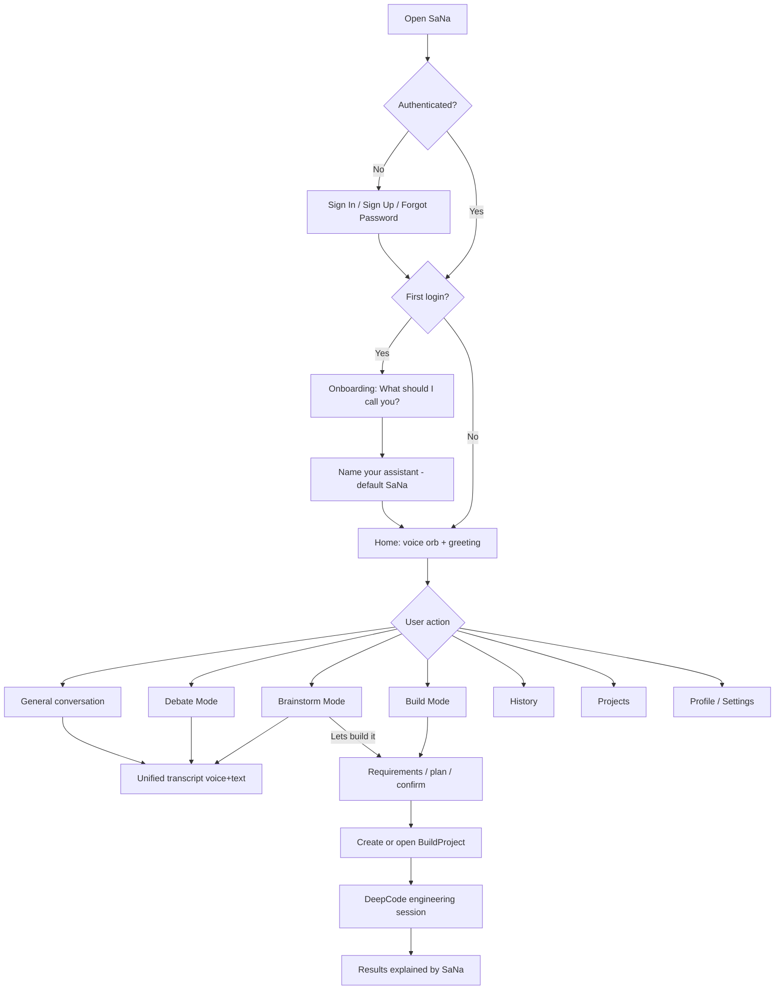
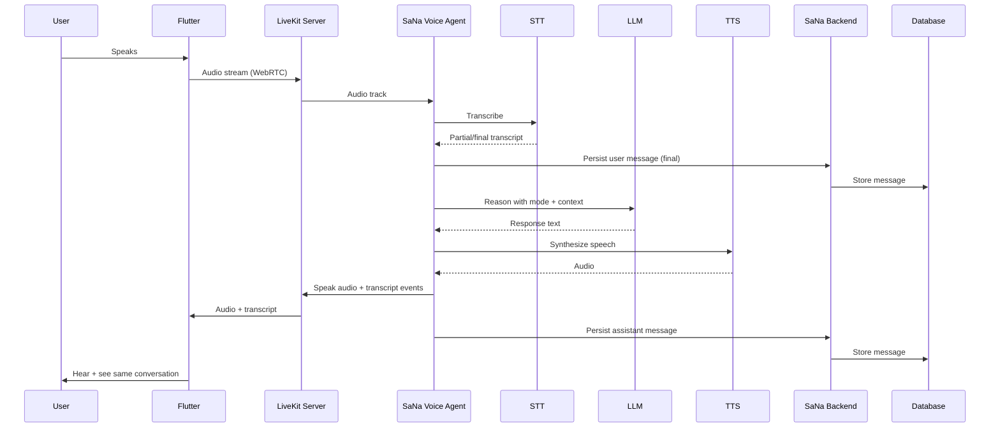
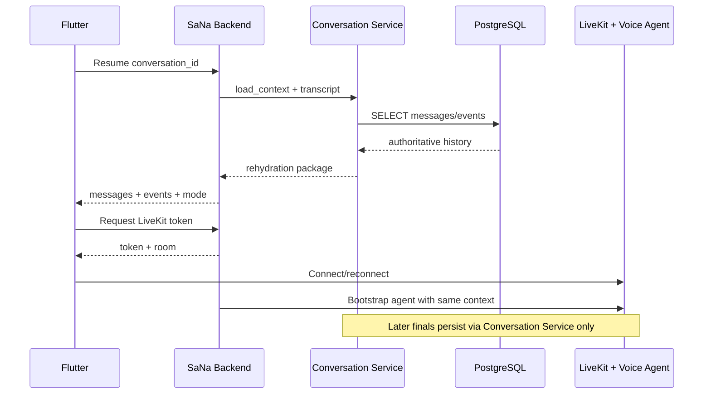
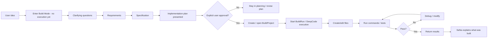
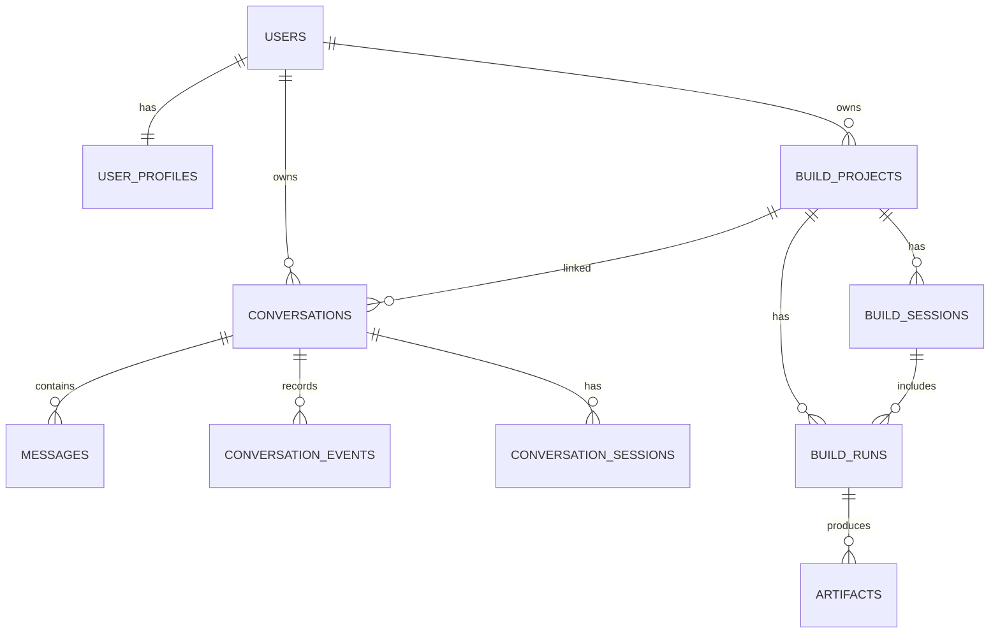

# SaNa — Product Requirements Document (PRD)

**Status:** Phase 5 COMPLETE — Sana branded UI (black + muted-lavender orb, mode/nav shells); Phase 6 next
**Product:** SaNa
**Document version:** 0.4.0
**Date:** 2026-08-09
**Audience:** Founder + future implementers (beginner-friendly)

### Revision history

| Version | Date | Summary |
|---|---|---|
| 0.3.0 | 2026-08-08 | Architecture/MVP decisions approved; text-first then voice phase order |
| **0.4.0** | **2026-08-09** | **LiveKit-first implementation reset: official LiveKit starters/patterns prioritized; voice vertical slice before custom UI polish; first Flutter/UI prototype archived on `SaiSree_development`; core SaNa product scope unchanged** |
| 0.4.0 (Phase 2 note) | 2026-08-09 | Phase 2 Flutter client foundation accepted: `mobile/` starter connected via LiveKit Cloud sandbox token ID; physical Android voice validated; custom SaNa UI still deferred |
| 0.4.0 (Phase 3 note) | 2026-08-09 | Phase 3 voice vertical-slice stabilization accepted on physical Android; connect/cancel hardening; Technical Voice Proof complete; custom SaNa UI still deferred |

### v0.4.0 revision summary

This is a **controlled implementation reset**, not a product reset.

- **LiveKit-first implementation:** prove the realtime voice vertical slice before polishing the custom SaNa interface.
- **Official LiveKit starters/patterns** (`agent-starter-flutter`, `agent-starter-python` via LiveKit CLI) will be adapted as technical foundations.
- **Voice vertical slice is prioritized** before branded UI polish, auth, persistence, and modes.
- **First UI prototype is archived** on branch `SaiSree_development` and must not be deleted.
- **Core SaNa product scope remains unchanged** — developer-focused conversational intelligence, modes, DeepCode Build Mode, Supabase, FastAPI, hybrid voice, muted-lavender identity.

No application scaffolding begins until this PRD is approved.

---

## Project history and branch strategy (2026-08-09)

| Branch / location | Role |
|---|---|
| `main` | Original Phase 0 prerequisites and PRD v0.3.0 baseline |
| `SaiSree_development` | Archived first Flutter/UI prototype — **preserve; do not delete** |
| `SaiSree_livekit_rebuild` | New clean implementation branch for the LiveKit-first rebuild |

### What changed vs what did not

| Preserved | Changed |
|---|---|
| Product vision and SaNa requirements | Implementation **order** (voice proof before UI polish) |
| Product architecture usefulness (modes, Conversation Service, DeepCode, FastAPI, Supabase) | Use of official LiveKit starter foundations |
| First prototype history (archived on `SaiSree_development`) | Active development workspace (outside OneDrive) |
| SaNa branded UI goals | Timing of branded UI work (after voice vertical slice) |

**Rationale:** prove the actual realtime voice experience before spending more time polishing a custom interface that is not yet wired to a working voice stack.

**Workspace note:** active Git/build work for this rebuild uses `C:\Users\saisr\Projects\SANA-LiveKit` (outside OneDrive). See [Development environment warning](#development-environment-warning).

---

## Approved architecture decisions (2026-08-08; LiveKit-first order updated 2026-08-09)

The following decisions remain **APPROVED** for architecture and MVP. Application scaffolding must not begin until the founder explicitly approves PRD v0.4.0 and the LiveKit-first phase plan.

| # | Decision | Status | Notes |
|---|---|---|---|
| 1 | Backend: **Python + FastAPI** | **APPROVED** | Broader backend remains Phase 9; minimal secure LiveKit token endpoint may come earlier when Flutter connection requires it |
| 2 | Auth/DB: **Supabase Auth + Supabase PostgreSQL** | **APPROVED** | Keep boundaries clean; avoid unnecessary Supabase lock-in |
| 3 | Flutter state: **Riverpod** | **APPROVED** | |
| 4 | Voice transport: **LiveKit** | **APPROVED** | Official starters as foundation; LiveKit Cloud project `sana` linked |
| 5 | Voice agents: **LiveKit Agents** | **APPROVED** | Python agent via official `agent-starter-python` patterns |
| 6 | Dev LLM: **OpenRouter free + optional Ollama** | **APPROVED** | Provider-independent; first technical proof uses official LiveKit starter defaults; final providers open until proof succeeds |
| 7 | DeepCode MVP: **DeepCodeAdapter** around verified CLI/JSON | **APPROVED WITH VERIFICATION REQUIRED** | Verify commands/flags/JSON/session behavior before implementing adapter body |
| 8 | Build MVP location: **Local trusted workspaces on PC** | **APPROVED FOR DEV/MVP** | Must be swappable later for sandboxed remote workers |
| 9 | Mode switching: **Same conversation** | **APPROVED** | Store mode changes as metadata/events |
| 10 | Voice stack: **C — Hybrid** | **APPROVED** | Prefer free/local when practical; substitute hosted for natural realtime UX |
| 11 | Device testing: **Emulator + physical Android device** | **APPROVED** | Emulator for UI; physical device required for realtime voice validation |
| 12 | Git/GitHub: **Use existing repository** | **APPROVED** | Do not create a new repo; never commit secrets |
| 13 | Branding/orb direction | **APPROVED (initial, refinable)** | Dark near-black/deep-navy + **muted-lavender** identity; organic animated SaNa orb |
| 14 | Implementation order: **LiveKit-first** | **PROPOSED in v0.4.0** | Voice vertical slice before custom UI polish / auth / persistence |
| 15 | Official LiveKit starters as foundation | **PROPOSED in v0.4.0** | Adapt `agent-starter-flutter` + `agent-starter-python`; do not copy undocumented APIs |

### Supabase boundary rule (approved)

- Use Supabase Auth for authentication.
- Use Supabase PostgreSQL as the primary database.
- Keep database/backend boundaries clean so SaNa is not unnecessarily locked into Supabase-specific features (prefer standard Postgres + portable repository interfaces).

### DeepCode verification gate (approved)

Before implementing the DeepCode adapter body:

1. Verify the actual installed DeepCode CLI commands.
2. Verify that `deepcode exec` / `deepcode loop` with `--json` is valid for the installed version.
3. Verify the actual JSON output/schema from real runs.
4. Verify session/project continuation behavior (`--resume`, workspace persistence).
5. Do **not** invent commands, flags, APIs, JSON structures, or endpoints.

Create the adapter **abstraction** so the rest of SaNa does not depend directly on the DeepCode CLI. Swap later without rewriting Build Mode core.

### Build workspace rule (approved)

- MVP builds run only in explicitly designated local project workspaces.
- Do **not** give DeepCode unrestricted access outside those workspaces.
- Architect Build Mode so local workspaces can later be replaced by isolated/sandboxed remote workers without rewriting SaNa’s core Build Mode.

### Git / secrets rule (approved)

- Use the existing GitHub repository; do not create a new one.
- Inspect existing repository/history before changes.
- Preserve current history and existing files.
- Create sensible commits/checkpoints as development progresses.
- Ensure sensitive files are covered by `.gitignore`.

**Secret handling (explicit):**

- LiveKit CLI credentials remain **outside the repository** (local CLI auth/config; never committed).
- Repository `.env`, `.env.local`, API secrets, and generated local LiveKit secret/configuration files must be **ignored** by Git.
- No API key, secret, or access token may appear in `PRD.md` or any committed file.
- Flutter must never contain the LiveKit API secret or other server credentials.

**GitHub repository (resolved 2026-08-08):**
[https://github.com/saisree510/SaNa-Voice-Intelligence.git](https://github.com/saisree510/SaNa-Voice-Intelligence.git)

- Existing product repo for SaNa — **do not create a new repository**
- Do **not** use upstream `HKUDS/DeepCode` as SaNa’s product repo
- Active rebuild branch: `SaiSree_livekit_rebuild` (tracks `origin/SaiSree_livekit_rebuild`)
- Archived first Flutter/UI prototype: `SaiSree_development` — preserve; do not delete
- `main` retains original Phase 0 prerequisites and PRD v0.3.0 baseline
- Normal Git authentication and pushes already work; GitHub CLI (`gh`) authentication is **optional**

---

## Proposed repository structure (approve before scaffolding)

> **Proposal only.** Do not create these folders until the founder approves PRD v0.4.0 and scaffolding is explicitly authorized.

```text
SaNa-Voice-Intelligence/
├── mobile/              # Flutter application using LiveKit client foundation
├── voice_agent/         # Python LiveKit Agent
├── backend/             # FastAPI orchestration/token APIs, introduced later
├── docs/                # Supporting architecture/development documentation if needed
├── PRD.md
├── .gitignore
└── .env.example
```

| Path | Purpose |
|---|---|
| `mobile/` | User-facing Flutter application (adapt official LiveKit Flutter starter patterns) |
| `voice_agent/` | Server-side realtime SaNa participant (Python LiveKit Agent). Use **`uv`** with a project-managed virtual environment; prefer **Python 3.13** for reproducibility (official starter supports Python **>=3.10 and <3.15**) |
| `backend/` | Application APIs, auth coordination, LiveKit token generation, persistence, Build Mode orchestration. Broader FastAPI backend remains Phase 9; a minimal secure LiveKit token endpoint may be introduced earlier when the Flutter connection requires it |
| `docs/` | Optional supporting architecture/development notes |

### Scaffolding rules

- Do **not** create nested Git repositories.
- LiveKit starter templates must be incorporated **without** retaining their internal `.git` metadata.
- Secrets and generated credentials must **never** be committed (see Git / secrets rule).
- Scaffolding strategy **resolved (Phase 1):** initialize directly into `voice_agent/`; remove nested starter `.git` before sync/commit; keep parent repo as sole Git root.

---

## LiveKit Cloud and CLI status (verified setup — no credentials)

Recorded for implementers. **Do not write API keys, API secrets, or full CLI configuration into this PRD or into Git.**

| Item | Status |
|---|---|
| LiveKit CLI installed | Verified |
| LiveKit Cloud authentication | Complete |
| LiveKit Cloud project named `sana` | Linked |
| `sana` is current default project | Yes |
| API key / API secret / full CLI config | **Never record or commit**; LiveKit CLI credentials remain outside the repository |
| Local LiveKit CLI configuration file | Outside repo / must not be committed |
| Repo `.env`, `.env.local`, generated LiveKit secret/config files | Must be Git-ignored; never appear in `PRD.md` or commits |

Useful **read-only** documentation commands (allowed during research; not scaffolding):

- `lk docs overview`
- `lk docs search`
- `lk docs get-page`
- `lk docs code-search`

Do **not** execute scaffolding or deployment commands until after PRD approval and an explicit implementation go-ahead.

---

## Development environment warning

The original workspace inside OneDrive caused file-locking problems involving:

- Git object cleanup
- build directories
- branch switching/deletion

The LiveKit rebuild now uses a workspace **outside OneDrive**:

`C:\Users\saisr\Projects\SANA-LiveKit`

**Recommendation:** keep active Git and build work outside cloud-synchronized folders. Do not include secrets or personal credentials in docs or commits.

---

## How to read this document

This PRD explains **what SaNa is**, **how users experience it**, and **how the systems should fit together**.

Wherever a technology is recommended, this document explains:

- what it is
- why SaNa needs it
- what problem it solves
- where it runs
- how it communicates with other parts
- whether it is open-source
- whether it can be free during development
- whether it may cost money in production
- what alternatives exist

**Important principle:** if something was not verified in the current environment or official docs, it is labeled **TBD / Requires verification**. This PRD does **not** invent DeepCode REST endpoints or fictional SDKs.

---

## Table of contents

1. Product overview
2. Problem statement
3. Product vision
4. Product principles
5. Target users
6. User personas
7. Primary use cases
8. MVP scope (Technical Voice Proof vs Product MVP)
9. Non-goals
10. Future scope
11. Complete user journey
12. Authentication flow
13. Onboarding flow
14. Home experience
15. Voice interaction
16. Text interaction
17. Unified conversation model
18. Conversation history
19. General Mode
20. Debate Mode
21. Brainstorm Mode
22. Build Mode
23. DeepCode architecture
24. Persistent Build Projects
25. Build lifecycle
26. Build status/progress
27. LiveKit architecture (official foundation + token strategy)
28. STT architecture
29. LLM architecture
30. TTS architecture
31. OpenRouter / local model strategy
32. Ollama strategy
33. Backend architecture
34. Flutter architecture
35. Database architecture
36. Database schema
37. API boundaries
38. State management
39. Memory architecture
40. Security
41. Build sandbox / security
42. Error handling
43. Offline / reconnection behavior
44. Functional requirements
45. Non-functional requirements
46. Performance / latency expectations
47. Testing strategy
48. Prerequisite checklist
49. Required accounts / API keys
50. Free vs paid infrastructure
51. Development phases (LiveKit-first)
52. MVP acceptance criteria
53. Risks
54. Technical unknowns
55. Open questions
56. Decisions — approval status

Also see earlier sections: project history, proposed repository structure, LiveKit Cloud/CLI status, development environment warning.

---

## 1. Product overview

**SaNa** is a developer-focused **conversational intelligence** mobile app.

SaNa is:

- voice-first, but **not** voice-only
- conversation-first, but **not** “just a chatbot”
- an AI technical partner a developer can talk with naturally

SaNa helps developers:

- discuss coding problems
- learn technical concepts
- discuss AI and software engineering
- debate technical ideas
- brainstorm projects
- design software and architectures
- solve development problems
- **build actual software projects**
- continue improving previously created projects

### What SaNa is not

| Not this | Why |
|---|---|
| Just a chatbot | Modes, voice, persistence, and Build Mode make it a product |
| Just a voice assistant | Text and voice share one conversation |
| DeepCode itself | DeepCode is the engineering engine used by Build Mode |
| LiveKit itself | LiveKit is realtime communication infrastructure |

**Simple summary:**
SaNa is the product experience. DeepCode is the builder. LiveKit is the realtime voice pipe.

---

## 2. Problem statement

Developers often bounce between:

- ChatGPT / Claude for thinking
- IDEs / coding agents for building
- notes apps for ideas
- separate voice tools that do not keep context

This creates friction:

1. Voice and text conversations are disconnected.
2. Brainstorming and building live in different tools.
3. Projects are hard to reopen and continue later.
4. Coding agents are powerful but not designed as a calm, mobile-first technical partner.

SaNa aims to unify:

**conversation + reasoning modes + engineering execution**

into one coherent mobile experience.

---

## 3. Product vision

SaNa should feel like:

> “A calm, premium AI technical partner in your pocket — one you can talk to, type to, debate with, brainstorm with, and eventually ask to build and evolve real software.”

Long-term vision:

- developers start ideas by speaking
- refine them through Debate / Brainstorm
- convert promising ideas into Build Projects
- continue those projects over days/weeks
- always keep one synchronized conversation transcript

---

## 4. Product principles

1. **Voice-first, not voice-only** — speaking and typing are equal interfaces to one conversation.
2. **One conversation model** — never separate “voice chats” and “text chats.”
3. **Modes, not separate apps** — General / Debate / Brainstorm / Build share one architecture.
4. **LiveKit-first vertical slice before UI polish** — prove the complete realtime voice path before investing in the final branded interface (see below).
5. **Prove layers independently** — do not build everything at once.
6. **Do not block Build Mode later** — early choices must leave room for DeepCode + sandboxes.
7. **Secrets never live in Flutter** — API keys stay on backend / local secure config; Flutter must never contain the LiveKit API secret.
8. **Prefer free/open during development** — without pretending local/open always means free hosted.
9. **Do not invent integrations** — verify DeepCode / LiveKit / provider capabilities against official docs before coding against them; do not copy undocumented APIs.
10. **Explain, don’t dump** — errors should be human-friendly; technical details optional.
11. **Teach while building** — architecture should stay understandable to a learning founder.
12. **Official LiveKit foundations, SaNa branded UI** — adapt official starters for session/media/agent patterns; do **not** ship the starter’s generic visual UI as SaNa’s final product interface.

### LiveKit-first product-engineering principle (v0.4.0)

Before polishing the final SaNa interface, prove a complete realtime voice vertical slice:

```text
User speaks
  → Flutter sends microphone audio through LiveKit
  → LiveKit Agent receives the turn
  → STT produces transcript
  → LLM generates response
  → TTS produces speech
  → user hears SaNa
  → transcript is visible
  → interruption / barge-in works
  → reconnect behavior is tested
```

This proves the central product experience before additional UI and product layers (branded orb polish, auth, persistence, Debate/Brainstorm/Build) are added.

### Component ownership (unchanged)

| Component | Role |
|---|---|
| **SaNa** | The complete product, conversational experience, and orchestration layer |
| **LiveKit** | Realtime voice/session infrastructure |
| **DeepCode** | Engineering engine behind Build Mode |
| **Supabase** | Authentication and PostgreSQL hosting for the MVP |

---

## 5. Target users

### Primary

- Indie developers / solo builders
- Students learning software engineering / AI
- Mobile-first developers who want to think out loud
- Builders who want an AI partner for ideation + implementation

### Secondary (later)

- Small engineering teams
- Mentors / tutors
- Hackathon builders

### Not initial target

- Enterprise compliance-first orgs
- Non-technical consumers wanting a general life assistant

---

## 6. User personas

### Persona A — “Sai, the learning builder”

- Learning Flutter + AI systems
- Wants to talk through ideas, not only type
- Has limited budget for APIs
- Wants to eventually build real apps with AI help

Needs:

- low-cost development stack
- clear explanations
- ability to reopen projects later

### Persona B — “Maya, the late-night debugger”

- Experienced developer stuck on architecture tradeoffs
- Wants Debate Mode to stress-test ideas
- Sometimes wants Build Mode to scaffold solutions

Needs:

- strong reasoning
- conversation history
- mode switching without losing context

### Persona C — “Leo, the idea machine”

- Generates many product ideas
- Needs Brainstorm Mode to structure them
- Wants “let’s build it” conversion into a project

Needs:

- idea organization
- conversion into Build Projects
- persistence across days

---

## 7. Primary use cases

1. Sign up / sign in securely
2. First-time onboarding (user name + assistant name)
3. Ask a technical question by voice
4. Continue the same conversation by typing
5. Browse and resume conversation history
6. Enter Debate Mode and challenge an idea
7. Enter Brainstorm Mode and expand a product idea
8. Convert a brainstorm into Build Mode
9. Create a Build Project via DeepCode (MVP: controlled local/dev workspace)
10. Reopen an existing Build Project and request changes
11. See human-friendly status during builds (only when backed by real state)
12. Recover gracefully from network / AI / microphone failures

---

## 8. MVP scope

MVP means: **a real usable Android prototype**, not production perfection.

v0.4.0 distinguishes an early **Technical Voice Proof** from the complete **Product MVP**.
**Do not** treat the Technical Voice Proof as the completed SaNa MVP.

### Technical Voice Proof (Phases 1–3; early delivery gate)

Proves the realtime architecture and voice experience:

- Python LiveKit agent (`voice_agent/`, official starter foundation)
- Flutter LiveKit client (`mobile/`, official starter foundation; temporary starter UI OK)
- Voice input / output
- Visible transcript
- Text input into the same session
- Interruption / barge-in
- Reconnection understanding
- Initial provider cost/latency documented

In-memory / session history is acceptable for this proof. Database persistence comes later.

### Product MVP (complete SaNa MVP — unchanged product scope)

- SaNa branded Flutter UI (dark near-black/deep-navy + muted-lavender; organic orb; personalized greeting; modes; transcript reveal; History; Projects; Profile)
- Authentication / onboarding (Supabase Auth)
- Persistent unified conversations (PostgreSQL via Conversation Service)
- General / Debate / Brainstorm modes
- DeepCode Build Mode proof (after verification gate; explicit approval before execution)
- Persistent Build Project continuation
- Hybrid voice stack interfaces (local preferred when practical; hosted substitutable)
- Provider-independent LLM layer
- Secure backend token/credential handling
- No unrestricted code execution on the phone

### Finalized Product MVP checklist (approved scope, LiveKit-first delivery order)

- Flutter Android app (emulator for UI; physical device required for voice validation)
- Supabase Auth + Supabase PostgreSQL (portable DB boundaries)
- Authentication (sign up / sign in / sign out / password reset / session persistence)
- First-time onboarding (user name + assistant name; speak or type)
- Home screen with SaNa voice orb + Debate / Brainstorm / Build controls
- Dark-first, muted-lavender design system with refinable orb/branding tokens
- Unified voice + text conversation in the **same** conversation
- Mode changes stored as metadata/events inside that conversation
- Real-time transcription into the same transcript
- Persistent conversations + history + resume
- Debate Mode
- Brainstorm Mode
- Basic Build Mode with swappable execution backend
- DeepCodeAdapter abstraction + verified CLI/JSON POC (after verification gate)
- Simple Build Project persistence + reopen/continue
- Local trusted workspaces for builds (dev/MVP only)
- Hybrid voice stack interfaces
- Provider-independent LLM layer (OpenRouter free / Ollama optional longer-term; first voice proof may use simplest officially supported stack)

### Explicitly deferred from MVP

- Production-grade multi-tenant sandboxing / remote build workers
- GitHub import/export of user projects
- APK/web preview hosting
- Deployment pipelines
- Collaborative multi-user projects
- Advanced long-term memory / RAG
- Custom voices / personalities marketplace
- Finalized brand identity lock
- iOS release polish
- Polished orb before the voice vertical slice works (simple state visualizer is acceptable early)

---

## 9. Non-goals

- Building a full IDE on the phone
- Running arbitrary AI-generated code on-device
- Tight coupling to one LLM vendor
- Storing raw microphone audio by default
- Fake “progress theater” not backed by real build events
- Replacing DeepCode’s own Desktop/CLI UX
- Building every mode as a separate product

---

## 10. Future scope (post-MVP)

- Production sandboxed Build Mode (containers / isolated workers)
- GitHub integration (import / export / PRs)
- Build previews (web/APK artifacts)
- Deployment helpers
- Collaborative projects
- Advanced long-term memory
- Advanced RAG over user projects/docs
- Multiple SaNa voices / personalities
- Project sharing
- Multi-agent engineering workflows
- iOS parity

---

## 11. Complete user journey



### Plain-English journey

1. You open SaNa.
2. If needed, you sign in.
3. First time: SaNa asks what to call you, then what to call itself.
4. Home appears with the voice orb and a greeting like: “Hey Sai, what are we working on today?”
5. You can talk normally, or choose Debate / Brainstorm / Build.
6. Whatever you say or type becomes one shared conversation.
7. If you build something, SaNa coordinates DeepCode to create/modify a project in a safe workspace.
8. Later, you can reopen that project and continue.

---

## 12. Authentication flow

### Screens (unauthenticated)

- Sign In
- Sign Up
- Forgot Password

### Supported actions

- Register
- Sign in
- Sign out
- Password reset
- Persistent login session
- Secure backend authentication

### Security rule

Flutter must **never** contain:

- OpenRouter keys
- LiveKit API secrets
- database service-role keys
- DeepCode credentials
- any server master secrets

Flutter may hold only **user session tokens** issued by the auth system.

### Approved approach

**Supabase Auth** + **Supabase PostgreSQL** for MVP (**APPROVED**).

| Topic | Detail |
|---|---|
| What it is | Managed auth + Postgres platform |
| Why SaNa needs it | Secure accounts without building auth from scratch |
| Problem solved | Sign-up, login, sessions, password reset, user IDs |
| Where it runs | Supabase cloud (or self-host later) |
| Communication | Flutter ↔ Supabase Auth SDK; Backend verifies JWT |
| Open-source? | Supabase stack is open-source; hosted service is commercial |
| Free for development? | Yes, generous free tier typically |
| Production cost? | May cost money as usage grows |
| Alternatives | Firebase Auth, Auth0/Clerk, custom FastAPI+JWT+Postgres |

**Boundary rule:** use standard Postgres schemas/repositories and keep SaNa Backend as the orchestration boundary so we are not unnecessarily locked into Supabase-only features.

---

## 13. Onboarding flow

Triggered only on **first successful sign-in** when profile is incomplete.

### Step 1 — User name

SaNa asks:

> “What should I call you?”

User may **speak or type**.

Example answer: `Sai`

Store as `user_profiles.display_name`.

### Step 2 — Assistant name

Allow naming the conversational intelligence.

Default: `SaNa`

Example:

- User name: Sai
- Assistant name: SaNa

Store as `user_profiles.assistant_name`.

### Returning users

Skip onboarding if profile already has required fields.

---

## 14. Home experience

After onboarding, open the primary conversation screen.

### Greeting example

> “Hey Sai, what are we working on today?”

### Primary visual

Centered **SaNa voice orb / logo**.

### Orb states (eventually driven by LiveKit / agent session state)

| LiveKit / session condition | SaNa orb state |
|---|---|
| Disconnected | `idle` |
| Connecting | `connecting` |
| User speech detected | `userSpeaking` |
| Listening | `listening` |
| Agent processing | `thinking` |
| Agent audio playing | `speaking` |
| Reconnecting | `reconnecting` |
| Failure | `error` |

Exact mapping via current Flutter/LiveKit APIs: **TBD / Requires verification** (Open Question).

### Approved visual identity (retained; branded UI after voice proof)

SaNa should feel intelligent, calm, friendly, developer-focused, premium, and futuristic **without** excessive cyberpunk styling.

- Dark near-black / deep-navy background
- **Muted-lavender** identity (primary brand signal)
- Organic animated SaNa orb
- Personalized greeting
- Soft, calm motion rather than aggressive neon
- Different animation behavior for listening / thinking / speaking (not only color swaps)

The voice orb is the main visual identity. Branding is **not** over-finalized: design tokens for colors, gradients, and orb motion must remain refinable.

**Important (v0.4.0):** do **not** require a finalized/polished orb before the voice vertical slice works. A simple state visualizer is acceptable during early LiveKit integration. The official LiveKit Flutter starter UI may be used temporarily; SaNa will **not** adopt the starter’s generic visual interface as the final product UI.

### Mode controls (Product MVP UI)

1. General (default)
2. Debate
3. Brainstorm
4. Build

Users can talk in **General Mode** without selecting a dedicated control.

### Navigation (minimal — Product MVP)

- Home
- History
- Projects
- Profile / Settings

### Device testing policy (approved)

- Temporary starter UI and early integration may use emulator where useful
- Once microphone, LiveKit, STT/TTS, audio routing, permissions, interruption/barge-in, and realtime voice are introduced, test frequently on a **physical Android device**
- Real voice UX cannot be validated adequately on emulator alone

---

## 15. Voice interaction

### Plain English

When you speak, your phone sends audio into a realtime session. A voice agent turns speech into text, thinks, speaks back, and the written transcript updates at the same time.

### Technical flow



### Requirements

- Microphone permission handling
- Secure token access (dev sandbox/official mechanisms early; FastAPI short-lived tokens for production)
- Connection / reconnection lifecycle
- User speech detection / assistant speech detection
- Interruptions / barge-in (where supported by LiveKit Agents)
- Partial + final transcripts
- Transcript synchronization with chat UI
- Natural error messaging on failures

**v0.4.0 timing:** Phases 1–3 prove this vertical slice end-to-end (in-memory/session history OK). Backend persistence of finals arrives in Phase 7.

---

## 16. Text interaction

Users can type at any time in the transcript view.

Typed messages:

- join the **same conversation**
- use the same mode / context loaded from PostgreSQL via Conversation Service
- are persisted like voice transcripts through the same Conversation Service
- may be answered by voice, text, or both depending on session state

### Typed turn path (FastAPI)

```text
Flutter typed message
  → SaNa Backend REST/SSE
    → Conversation Service
      → load conversation context from PostgreSQL (messages + recent events)
      → AI Orchestrator (current mode)
      → LLMProvider
      → persist assistant message (idempotent)
      → return/stream response to Flutter
```

MVP recommendation for simultaneous voice+text:

- If a LiveKit voice session is active, typed text should be injected into the same agent session when supported (**requires verification** of LiveKit Agents text-input path; Flutter starter docs indicate text input is supported), **and** still persisted through Conversation Service.
- If voice is inactive, text uses the FastAPI path above exclusively.

---

## 17. Unified conversation model

### Core rule

Voice and text are two interfaces to **one conversation**.

Example:

1. User speaks: “SaNa, explain what LangGraph does.”
2. Transcript shows user text.
3. SaNa answers by voice and text.
4. User types: “How is it different from CrewAI?”
5. SaNa continues with full prior context.

There are **not** separate voice conversation objects and text conversation objects.

### Authoritative persisted history

**PostgreSQL, accessed through SaNa’s Conversation Service, will eventually be the authoritative persisted conversation history.**

| Store | Role |
|---|---|
| PostgreSQL `messages` / `conversation_events` / `conversations` | **Source of truth** for durable history, resume, audit, and LLM context assembly (Product MVP) |
| LiveKit session messages | Realtime representation of the **active** conversation |
| LiveKit room / agent in-memory state | Ephemeral realtime transport; acceptable as sole history for the **Technical Voice Proof** |
| Flutter local UI state | Display/cache only; may be stale; must rehydrate from Conversation Service once persistence exists |

LiveKit must **not** be treated as the long-term conversation database for the Product MVP.
Final transcripts and assistant messages will be persisted. Partial transcripts must **not** become durable messages. Idempotency keys must prevent duplicate messages. Voice and typed turns must use the same conversation context. Reconnecting/resuming should rehydrate context from the authoritative history.

**v0.4.0 timing note:** for the first voice proof, in-memory / session history is acceptable. Database persistence is introduced later in the revised phases (Phase 7). Once Conversation Service exists, if LiveKit disconnects, Conversation Service + PostgreSQL remain the truth.

### Shared context for voice and text turns

Both paths must resolve the same `conversation_id` and assemble context from the same Conversation Service:

```text
Shared context assembly (Conversation Service)
  1. Load conversation row (current mode, linked build project, etc.)
  2. Load recent messages (authoritative transcript)
  3. Load recent conversation_events (mode changes, build links, session transitions)
  4. Apply user preferences (display name, assistant name)
  5. Produce Mode-aware prompt/context package for LLM / voice agent
```

#### Voice turn path (LiveKit)

```text
Flutter mic
  → LiveKit Server
    → SaNa Voice Agent
      → STT (partials are UI-only; not durable messages)
      → on FINAL user transcript:
          Conversation Service.persist_message(idempotent)
      → Conversation Service.load_context(conversation_id)
      → LLM (+ mode behavior)
      → TTS + speak via LiveKit
      → Conversation Service.persist_message(assistant, idempotent)
      → Flutter shows same transcript from realtime events + eventual DB sync
```

#### Text turn path (FastAPI)

```text
Flutter text send
  → FastAPI
    → Conversation Service.persist_message(user text, idempotent)
    → Conversation Service.load_context(conversation_id)
    → AI Orchestrator / LLMProvider
    → Conversation Service.persist_message(assistant, idempotent)
    → stream/return to Flutter
```

Both paths write and read the **same** conversation records.

### Context rehydration (reconnect / resume later)

When a voice session reconnects, or when a user resumes a conversation later (voice or text):

1. Flutter (or agent bootstrap) calls SaNa Backend with `conversation_id` (+ auth).
2. Conversation Service loads authoritative messages + conversation_events from PostgreSQL.
3. Backend returns a rehydration package: conversation metadata, ordered messages, recent events, current mode, linked build project if any.
4. Flutter replaces/reconciles local transcript UI with the authoritative list (dedupe by message identity).
5. If starting/resuming LiveKit:
   - mint a new short-lived token for a room tied to that `conversation_id`
   - Voice Agent receives bootstrap context from Conversation Service **before** generating replies
   - Agent must not invent prior turns from stale in-memory state alone
6. Only **final** transcripts after reconnect may create new messages; replays/duplicates are rejected by idempotency keys.



### Idempotency / deduplication for realtime persistence

Realtime voice can emit partial transcripts, repeated finals, and reconnect replays. Persistence must be idempotent so duplicates cannot create multiple rows.

**Rules:**

1. **Partials never become durable messages.** UI may show interim text; only finals (or explicit text sends) persist.
2. Every persist request carries a **client/event idempotency key** (unique per logical utterance/turn), for example:
   - `idempotency_key` / `client_message_id`
   - optional stable provider ids when available (`transcript_final_id`, agent turn id)
3. Conversation Service upserts by unique key: same key → return existing message; do not insert again.
4. Content edits to the same logical utterance (rare STT revision) update the existing row or create a revision record — they must not create a second unrelated user message for the same utterance.
5. Assistant replies likewise use turn-level idempotency keys.
6. Reconnection bootstrap reloads from DB; it must not re-persist historical messages already stored.
7. Flutter dedupes locally by `message_id` / `idempotency_key` when merging LiveKit events with API history.

Suggested uniqueness:

```text
UNIQUE (conversation_id, idempotency_key)
```

### Suggested interaction: reveal transcript by swipe

**Voice-first view**

- Orb
- Mode cards
- Voice controls

**Swipe / scroll upward**

**Transcript view**

- Messages
- Text input + send
- Persistent voice controls

This should feel like revealing another representation of the same conversation, not opening a different chatbot.

---

## 18. Conversation history

Users can:

- view previous conversations
- search conversations (**MVP: title/content search; advanced ranking later**)
- resume a conversation
- continue with voice or text

**Authoritative store:** PostgreSQL via Conversation Service (not LiveKit, not Flutter cache).

Each conversation stores a current mode:

- `general`
- `debate`
- `brainstorm`
- `build`

Mode changes over time are also recorded as `conversation_events` (see below), so history can show which mode produced which segment even if the conversation later switches modes.

### Stored conversation fields (minimum)

- conversation_id
- user_id
- title
- mode (current)
- created_at
- updated_at

### Stored message fields (minimum)

- message_id
- conversation_id
- sender (`user` / `assistant` / `system`)
- content
- source (`voice` / `text`)
- idempotency_key
- timestamp
- metadata (JSON)

### conversation_events (important non-message events)

Not every durable fact is a chat bubble. SaNa records important non-message events in `conversation_events`.

Examples:

| event_type | Purpose |
|---|---|
| `mode_changed` | General ↔ Debate ↔ Brainstorm ↔ Build |
| `build_project_linked` | Conversation associated with a BuildProject |
| `build_project_unlinked` | Link removed/changed |
| `build_approval_requested` | Plan presented; waiting for explicit user approval |
| `build_approval_granted` | User approved starting execution |
| `build_approval_denied` | User declined execution |
| `voice_session_started` | LiveKit/voice session began |
| `voice_session_ended` | Voice session ended cleanly |
| `voice_session_reconnected` | Session recovered after disconnect |
| `conversation_resumed` | User reopened conversation later |

These events:

- preserve mode/project/session timeline without polluting the message transcript
- help rehydrate context (current mode, linked project, pending approvals)
- support analytics/debugging later

### Audio storage policy

- **Default:** do **not** permanently store raw microphone audio
- Transcription becomes normal persisted text messages
- Optional later: encrypted audio retention with explicit user consent

---

## 19. General Mode

Default mode. No card required.

Supports:

- programming questions
- AI questions
- technical explanations
- architecture discussions
- debugging discussions
- learning
- project questions
- software engineering questions

Behavior:

- helpful technical partner
- asks clarifying questions when needed
- does not blindly start coding unless user enters Build Mode or clearly requests building

---

## 20. Debate Mode

Entry phrase:

> “Okay {userName}, what do you want to debate today?”

Example topic:

> “Microservices are always better than monoliths.”

SaNa should:

- challenge assumptions
- provide counterarguments
- ask probing questions
- identify weak/strong arguments
- provide technical evidence when possible
- explore tradeoffs
- avoid blind agreement
- help improve reasoning
- summarize when appropriate

Voice + text remain synchronized.

---

## 21. Brainstorm Mode

Entry phrase:

> “Okay {userName}, what are we brainstorming today?”

Example:

> “I want to build an AI application for recruiters.”

SaNa should:

- explore the idea
- generate alternatives
- expand incomplete ideas
- ask useful clarifications
- identify potential users
- suggest features
- discuss feasibility
- compare technology options
- discuss architecture
- identify risks
- organize ideas
- convert promising ideas into actionable project concepts

### Conversion into Build Mode

Brainstorm → refine → user says “Let’s build it” → create / enter Build Project workflow.

---

## 22. Build Mode — critical differentiator

### Plain English

Build Mode is where SaNa stops being only a thinking partner and becomes a project-building partner.

SaNa handles the human conversation.
**DeepCode handles engineering execution.**

### Critical rule: entering Build Mode does NOT execute code

Selecting Build Mode, saying “let’s build it,” or linking a Build Project only changes conversation mode / planning state.

SaNa must:

1. gather requirements
2. ask clarifying questions as needed
3. produce a specification / implementation plan
4. present that plan to the user
5. **wait for explicit user approval** before starting a new build execution

Until approval is granted, DeepCode must not begin file/command execution for that new run.

Record these as `conversation_events` where applicable:

- `build_approval_requested`
- `build_approval_granted`
- `build_approval_denied`

### Intended workflow



### Hard constraints

- Do **not** execute arbitrary AI-generated code on the user’s phone.
- Build execution belongs on backend infrastructure in an isolated / designated workspace.
- Entering Build Mode ≠ starting DeepCode.
- A new BuildRun requires explicit approval after the plan is shown.
- Dangerous/destructive operations require additional safeguards (see Build lifecycle / sandbox).

---

## 23. DeepCode architecture

### Verified identity of DeepCode in this environment

Inspected local installation:

- Product: **DeepCode — Open Agentic Coding** (HKUDS / `deepcode-hku`)
- Version observed: **DeepCode 2.0.0**
- CLI available: `deepcode.exe`
- Local config: `~/.deepcode/`
- Nearby source checkout observed: `Projects AI/DeepCode/DeepCode`

DeepCode is an **agentic coding/build engine**, not merely a knowledge base.

### Verified DeepCode capabilities (from local CLI + docs)

| Capability | Verified? | Evidence |
|---|---|---|
| Interactive CLI / TUI | Yes | `deepcode` default entry |
| Headless one-shot task | Yes | `deepcode exec "<task>"` |
| Durable goal loop | Yes | `deepcode loop "<goal>"` |
| Resume session | Yes | `--resume <session-id>` |
| Workspace selection | Yes | `--workspace` / `-w` |
| Machine-readable events | Yes | `deepcode exec ... --json` (NDJSON) |
| MCP server mode | Yes (exists) | `deepcode mcp` (stdio). Exact tool schema **TBD / Requires verification** |
| App Server | Yes | `deepcode-app-server` / JSON-RPC over **stdio** |
| HTTP REST API | **Not found** | No documented public REST API in inspected materials |
| Provider switching | Yes | `deepcode provider ...` |
| OpenRouter support | Yes | provider template `openrouter` |
| Ollama support | Yes | provider `ollama` (`http://localhost:11434/v1`) |
| Session persistence | Yes | `~/.deepcode/sessions/` JSONL + sqlite projection |
| Access presets | Yes | `ask`, `read-only`, `full-access` |
| Command sandbox / workspace fence | Yes | documented security profiles |
| Skills system | Yes | `deepcode skill ...` |
| Automations | Yes | `deepcode automation ...` |

### Important observed development note

A recent local headless session using OpenRouter model `anthropic/claude-sonnet-4.5` failed with OpenRouter **402 credits** error.
This confirms: having an OpenRouter account ≠ free unlimited paid-model usage. SaNa/DeepCode must prefer `openrouter/free` or `:free` variants / Ollama during development.

### SaNa ≠ DeepCode

```text
SaNa product experience
  ├── conversation UX
  ├── modes
  ├── auth / history / projects
  ├── voice orchestration
  └── Build Orchestrator
        └── DeepCodeAdapter
              └── DeepCode (exec/loop/MCP/app-server as available)
```

### Approved integration strategy (**APPROVED WITH VERIFICATION REQUIRED**)

Because no public DeepCode HTTP REST API was found, SaNa will use a **`DeepCodeAdapter`** abstraction so the rest of SaNa does not depend directly on the DeepCode CLI.

#### MVP adapter candidate (must re-verify before coding the body)

Candidate based on inspected DeepCode 2.0.0 help/docs (re-verify on implementation day):

```text
deepcode exec "<task>" \
  --workspace <build_project_workspace> \
  --resume <deepcode_session_id?> \
  --connection <provider_connection_id> \
  --model <model_id> \
  --access <ask|read-only|full-access> \
  --json
```

For longer goals:

```text
deepcode loop "<goal>" \
  --workspace <path> \
  --test-cmd "<verification command>" \
  --resume <session-id>
```

**Verification gate before adapter implementation:**

1. Re-run installed CLI help and confirm commands/flags.
2. Confirm `--json` is valid and capture real sample output.
3. Document actual JSON event schema from those samples (do not invent fields).
4. Confirm `--resume` / workspace continuation behavior with a tiny real task.
5. Only then implement the adapter body that parses verified events into SaNa Build Status.

SaNa Backend must parse only verified event shapes and map them into Build Status events.

#### Alternative adapter paths (later / optional)

| Path | Pros | Cons | Status |
|---|---|---|---|
| `deepcode exec/loop --json` | Documented, scriptable, resumable | Process orchestration complexity | **Recommended MVP** |
| `deepcode mcp` (stdio MCP) | Standard tool protocol | Schema/details need verification | Candidate |
| `deepcode-app-server` JSON-RPC stdio | Richer thread/turn model | Desktop-oriented, stdio not network API | Possible internal option |
| Invented REST API | Convenient | **Not real** | Forbidden |

### DeepCodeAdapter conceptual interface

```text
DeepCodeAdapter
- createSession(workspace, model, connection, access)
- runTurn(sessionId, prompt, options) -> eventStream
- runGoal(sessionId, goal, testCmd?) -> eventStream
- resume(sessionId)
- getSessionMetadata(sessionId)
- cancel(sessionId)                 # TBD / Requires verification of cancel semantics for CLI
```

If an ideal capability is missing, keep the adapter method and document the implementation gap rather than inventing DeepCode APIs.

### Technology card — DeepCode

| Topic | Detail |
|---|---|
| What it is | Open agentic coding system that can explore repos, edit files, run commands/tests, and iterate |
| Why SaNa needs it | Build Mode needs a real engineering engine |
| Problem solved | Creating/modifying software projects beyond chat-only code snippets |
| Where it runs | Developer machine / backend worker host (not on the phone) |
| Communication | SaNa Backend → DeepCodeAdapter → CLI/MCP/App Server |
| Open-source? | Yes (MIT-oriented open project; verify exact license in repo) |
| Free for development? | Software is free; LLM usage may still cost money |
| Production cost? | Compute + model inference costs |
| Alternatives | Aider, OpenHands, SWE-agent, custom LangGraph coding agents — but this project standardizes on DeepCode |

---

## 24. Persistent Build Projects

Build Mode must support continuing existing projects over time.

### Example

- Day 1: “Build me an expense tracker.”
- Day 3: “Open my expense tracker.” → “Add Google authentication.”
- Later: “Add dark mode.” / “Fix the login bug.” / “Explain how auth works.”

DeepCode should modify the **same workspace/project**, not regenerate everything.

### Entities

| Entity | Meaning |
|---|---|
| `BuildProject` | Long-lived project the user owns |
| `BuildSession` | A DeepCode/SaNa working session linked to a project |
| `BuildRun` | One execution attempt (a turn/goal run) |
| `Artifact` | Output such as logs, summaries, file manifests, test reports |

### Associations

- User → many BuildProjects
- BuildProject → many BuildSessions / BuildRuns
- BuildProject → one primary workspace path / repo identity
- BuildProject ↔ Conversation(s)
- BuildRun → Artifacts
- BuildSession may store DeepCode `session_id` for `--resume`

---

## 25. Build lifecycle

### MVP Build Mode (developer-controlled) — APPROVED

```text
Flutter
  → SaNa Backend
    → Build Orchestrator
      → WorkspaceBackend interface
        → LocalTrustedWorkspaceBackend (MVP)
      → DeepCodeAdapter
        → DeepCode (local process, workspace-fenced)
          → Explicitly designated local workspace directory only
            → create/edit/test
              → status/result
                → SaNa explains
```

### Production Build Mode (later) — architecture must allow swap

```text
Flutter
  → SaNa Backend
    → Build Orchestrator
      → WorkspaceBackend interface
        → SandboxedRemoteWorkspaceBackend (later)
      → DeepCodeAdapter
        → DeepCode inside isolated worker / container
          → Ephemeral or persistent sandbox workspace
            → resource/time/network limits
```

MVP explicitly allows local/developer-only execution.
Production sandboxing / hardening is Phase 13, not a blocker for the first voice prototype.
**Do not give DeepCode unrestricted access outside designated project workspaces.**

### Explicit approval gate before execution

Build Orchestrator states for a new run:

1. `planning` — requirements/spec/plan being produced (no DeepCode execution)
2. `awaiting_approval` — plan presented; blocked until user approves
3. `approved` — user explicitly approved; execution may start
4. `running` / `testing` / `debugging` / `completed` / `failed` / `cancelled`

Approval must be an explicit user action in the product (confirm button and/or clear confirm phrase handled as a deliberate approval event — not inferred merely from entering Build Mode).

### Dangerous / destructive operation safeguards

In addition to workspace fencing:

| Safeguard | Requirement |
|---|---|
| Workspace fence | DeepCode may only touch the designated BuildProject workspace |
| Default access preset | Prefer least privilege; avoid blanket unrestricted host access |
| Destructive command class | Deletes, mass overwrites, privilege changes, network exfil-like actions need extra confirmation or denial |
| Dependency/install scope | Limit to project workspace; no global machine mutation by default |
| Secrets | Never inject user cloud secrets into workspaces casually; redacted logs |
| Timeout / cancel | Every BuildRun has timeout and user-cancel path |
| Audit | Persist BuildRun status + summaries; link conversation_events for approval/execution transitions |

Exact command allow/deny policy details: refine during Phase 10–11 using DeepCode’s real access presets — do not invent unsupported controls.

---

## 26. Build status / progress

SaNa should eventually narrate progress conversationally, for example:

- “I’ve created the project.”
- “I’m implementing authentication now.”
- “The first build failed because of a dependency issue. I’m fixing it.”
- “The tests are passing.”
- “Your project is ready.”

### Allowed statuses (only when backed by real state)

- Understanding requirements
- Planning
- Waiting for user decision / awaiting approval (**required before new execution**)
- Creating project
- Coding
- Installing dependencies
- Building
- Testing
- Debugging
- Completed
- Failed
- Cancelled

### Mapping principle

Do **not** fake progress.
Map DeepCode NDJSON/tool events → SaNa BuildStatus only when evidence exists.

Exact event schema mapping: **TBD / Requires verification** during Phase 10 POC by capturing real `--json` output from sample runs.

---

## 27. LiveKit architecture

### Plain English

LiveKit is the realtime “phone line” between the Flutter app and the SaNa voice agent. It carries audio (and related realtime data) with low latency.

SaNa remains the product and orchestration layer. LiveKit is **not** the product UI and **not** the authoritative long-term conversation database.

### Official LiveKit foundation (approved implementation direction — v0.4.0)

SaNa will **adapt the official LiveKit starter architecture and supported components** rather than manually rebuilding realtime voice infrastructure.

| Foundation | Source | Target location (proposed) |
|---|---|---|
| Flutter reference | `livekit-examples/agent-starter-flutter` | `mobile/` |
| Python agent | `agent-starter-python` via LiveKit CLI | `voice_agent/` |

**Rules:**

- Do **not** copy undocumented APIs.
- Verify current LiveKit behavior using official documentation and the installed CLI where possible (`lk docs …` read-only commands).
- Do **not** retain nested `.git` metadata from starters.
- Do **not** adopt the Flutter starter’s generic visual interface as SaNa’s final branded UI.

### Relevant Flutter starter patterns to adapt

- LiveKit session lifecycle
- Room connection
- Microphone / media lifecycle
- Agent discovery / dispatch where applicable
- Text input
- Session messages
- Transcript handling
- Agent status
- Reconnection
- Pre-connect audio buffering
- Audio playback
- Permission handling
- Token source abstraction

### Relevant Python agent patterns to adapt

- LiveKit `AgentSession`
- STT / LLM / TTS (starter defaults for first technical proof)
- Turn detection
- Barge-in / interruption
- Agent instructions
- Tool calling
- Local development with **`uv`** and a project-managed Python environment (prefer **3.13**; starter supports >=3.10 and <3.15)
- Testing
- Deployment readiness

### Recommended topology

```text
Flutter Mobile App (mobile/)
   |  (WebRTC via LiveKit Flutter SDK — official starter patterns)
   v
LiveKit Cloud project `sana`  (dev default; credentials never in Git/PRD)
   |
   +--> SaNa Voice Agent (voice_agent/ — LiveKit Agents, Python)
          |
          +--> STT provider (replaceable)
          +--> LLM provider (replaceable)
          +--> TTS provider (replaceable)

Later:
Flutter / Agent ──▶ SaNa Backend (backend/ — FastAPI)
                      ├── short-lived LiveKit token minting
                      ├── Conversation Service → PostgreSQL
                      └── Build Orchestrator → DeepCode
```

### Token strategy

#### Development / prototype

- LiveKit Cloud development / sandbox token mechanisms may be used where **officially supported**.
- Credentials remain local and ignored by Git.
- Sandbox / development token mechanisms are **development-only**.
- Exact first-connection token mechanism: **Resolved for Phase 2** — LiveKit Cloud sandbox token server ID (`SandboxTokenSource` / `LIVEKIT_SANDBOX_ID`); production FastAPI tokens remain later.

#### Production

- Flutter must **never** contain the LiveKit API secret.
- FastAPI will generate short-lived, user-scoped LiveKit access tokens.
- Token generation must integrate with SaNa authentication and authorization.
- Users should only be allowed into their authorized rooms/sessions.

A minimal secure LiveKit token endpoint may be introduced earlier when the Flutter connection requires it. The broader SaNa FastAPI backend remains Phase 9.

### Concerns to design for

- Microphone permissions
- Room/session creation
- Secure token generation (dev sandbox vs production FastAPI)
- Connection lifecycle
- Reconnection
- Speech detection
- Interruptions / barge-in
- Latency
- Streaming / partial / final transcripts
- Transcript sync to DB + UI (after persistence phases)
- Network failures
- Agent failures
- Mapping LiveKit session state → SaNa orb states

### Technology card — LiveKit

| Topic | Detail |
|---|---|
| What it is | Open-source realtime WebRTC platform + Agents framework |
| Why SaNa needs it | Reliable low-latency voice sessions on mobile |
| Problem solved | Streaming mic audio / agent audio / realtime session lifecycle |
| Where it runs | LiveKit Cloud (current linked project `sana`) and/or local server + agent worker process |
| Communication | Flutter ↔ LiveKit; Agent ↔ LiveKit; Backend mints production tokens via LiveKit Server API |
| Open-source? | Yes (server + agents). Cloud is commercial |
| Free for development? | Cloud free allotments / sandbox mechanisms where supported; verify current allowances before enabling paid services |
| Production cost? | Cloud usage and hosted STT/LLM/TTS can cost money |
| Alternatives | Agora, WebRTC custom, Daily, raw WebSocket audio (usually worse DX) |

### Verified / documented LiveKit capabilities relevant to SaNa

- Flutter client SDK + official agent starter Flutter app exist
- Official Python agent starter exists via LiveKit CLI
- LiveKit Agents supports STT / LLM / TTS composition
- LiveKit Agents can use Ollama via OpenAI-compatible plugin (`openai.LLM.with_ollama`) — longer-term option
- Kokoro local TTS integration is documented for LiveKit Agents — longer-term option
- Local LiveKit server can run in `--dev` mode
- Current environment: LiveKit CLI installed; Cloud auth complete; project `sana` linked and default (**no credentials in this PRD**)

Anything not re-verified against current docs/CLI on implementation day remains **TBD / Requires verification**.

---

## 28. STT architecture

**STT = Speech-to-Text** (“listener that turns voice into words”)

### Options

| Option | Cost | Latency | Quality | Hardware | Complexity | Scalability |
|---|---|---|---|---|---|---|
| Hosted STT via LiveKit Inference / Deepgram / OpenAI | Paid (free credits possible) | Usually best | High | Low | Low | High |
| Local faster-whisper / Whisper-compatible server | Free compute-wise | Medium/high depending on GPU | Good | Medium/High | Medium | Limited to your machine |
| Fully on-device mobile STT | Free runtime | Variable | Variable | Phone CPU | High | Device-bound |

### Approved strategy: Hybrid (**APPROVED** — option C)

Separate concerns clearly:

- LiveKit transport / session
- STT provider
- LLM provider
- TTS provider

**First working vertical slice (v0.4.0) — temporary voice-stack decision:**

> Use the official LiveKit starter defaults for the first technical proof. Final provider selection and cost optimization remain open until the proof succeeds.

- Prefer the **simplest officially supported stack** (starter defaults) that produces a reliable realtime conversation.
- **Verify LiveKit Cloud usage and potential charges before running hosted inference.**
- Identify expected costs / free allowances before enabling paid services.
- Do not assume every open-weight model has free hosted inference.
- Do not hard-code a provider permanently.
- Keep STT / LLM / TTS replaceable.
- Do **not** require all local components in the first LiveKit proof.

Longer-term development options may include: hosted voice components for low latency; local Whisper-compatible STT; OpenRouter free models; Ollama; Kokoro TTS.

- Keep STT behind a replaceable interface: `SpeechToTextProvider`.
- If local STT cannot provide the latency/reliability/natural conversational experience SaNa requires, substitute a hosted STT provider without rewriting voice architecture.

Final STT/LLM/TTS provider selection after the proof: **open until the technical proof succeeds** (see Open Questions for cost verification).

---

## 29. LLM architecture

**LLM = Large Language Model** (“the reasoning brain”)

SaNa must use a **provider-independent** architecture.

### Conceptual interface

```text
LLMProvider
- chat(messages, tools?, stream?)
- listModels()
- healthcheck()

Implementations (examples):
- OpenRouterProvider
- OllamaProvider
- OpenAIProvider
- AnthropicProvider
```

No scattered business logic like `if provider == OpenAI` across the app.

### Where LLMs are used

1. **Conversation intelligence** (General / Debate / Brainstorm / Build planning)
2. **Voice agent responses** (via LiveKit Agents LLM plugin)
3. **DeepCode engineering** (DeepCode’s own provider system)

These can share provider settings conceptually, but may use different models (e.g., fast model for voice, stronger model for Build).

### Technology cards

#### OpenRouter

| Topic | Detail |
|---|---|
| What it is | Unified API gateway to many models |
| Why SaNa needs it | Easy model switching without rewriting app logic |
| Problem solved | One integration → many providers/models |
| Where it runs | Hosted API (`https://openrouter.ai/api/v1`) |
| Communication | Backend / DeepCode / Agents → HTTPS OpenAI-compatible API |
| Open-source? | No (commercial gateway); many routed models are open-weight |
| Free for development? | Yes via `openrouter/free` and `:free` variants, with rate limits |
| Production cost? | Paid models / higher volume will cost money |
| Alternatives | Direct OpenAI/Anthropic APIs, Together, Fireworks, local Ollama |

#### Distinctions (critical)

| Term | Meaning |
|---|---|
| Open-source / open-weight model | Model weights/code available; hosting may still cost money |
| Free hosted inference | Someone hosts it at $0 (often rate-limited, availability changes) |
| Paid hosted inference | Pay per token/request |
| Fully local inference | Runs on your machine (Ollama/vLLM); electricity/hardware cost, no API bill |

---

## 30. TTS architecture

**TTS = Text-to-Speech** (“speaker that turns words into voice”)

### Options

| Option | Notes |
|---|---|
| Kokoro via Kokoro-FastAPI | Open-weight; documented LiveKit Agents integration; good local/dev candidate |
| Hosted TTS (Cartesia / OpenAI / LiveKit Inference) | Higher quality/ops simplicity; costs money |
| Other local TTS | Possible, but evaluate latency/quality |

### Approved strategy: Hybrid (**APPROVED** — option C)

- For the first LiveKit technical proof, use official LiveKit starter defaults (including TTS); do not require Kokoro/local TTS up front.
- Verify LiveKit Cloud usage and potential charges before running hosted inference.
- Evaluate Kokoro / local TTS during later development when practical.
- Keep TTS behind a replaceable interface: `TextToSpeechProvider`.
- Final provider selection and cost optimization remain open until the technical proof succeeds.

---

## 31. OpenRouter / local model strategy

### Approved development preference (**APPROVED**)

1. Default to currently available OpenRouter free models (`openrouter/free` and/or `:free` variants) during early development
2. Support Ollama for local development/testing
3. Keep the LLM layer provider-independent so higher-quality hosted models can be introduced later without architectural changes
4. Do **not** assume a particular OpenRouter free model will remain available permanently
5. Implement graceful fallback when free model is unavailable / rate-limited
6. Avoid paid OpenRouter models unless intentionally approved

### Important lesson from current machine

A DeepCode headless run using a paid Anthropic model through OpenRouter failed due to insufficient credits.
For SaNa development:

- configure DeepCode connection to free/local models
- configure SaNa LLM layer similarly
- treat paid models as an explicit upgrade path

### DeepCode provider switching (verified)

DeepCode already supports switching connections/models via:

- `deepcode provider set ...`
- `--connection` and `--model` on `exec` / `loop`

So SaNa architecture can change DeepCode’s model/provider **without redesigning SaNa**.

---

## 32. Ollama strategy

### Technology card — Ollama

| Topic | Detail |
|---|---|
| What it is | Local model runner with simple CLI/API |
| Why SaNa needs it | Free local inference during development |
| Problem solved | Avoid API spend; private local experimentation |
| Where it runs | Your computer |
| Communication | OpenAI-compatible HTTP at `http://localhost:11434/v1` |
| Open-source? | Ollama client/tooling is available; model licenses vary |
| Free for development? | Yes (no API bill); uses your CPU/GPU/RAM |
| Production cost? | Your infra cost if self-hosting for users |
| Alternatives | vLLM, llama.cpp server, LM Studio, cloud GPUs |

### Hardware guidance (practical)

| Machine class | Realistic expectation |
|---|---|
| 8 GB RAM, no GPU | Small models only; may be slow for voice |
| 16 GB RAM | Small/medium models usable for text; voice may lag |
| 16 GB+ with strong GPU / Apple Silicon / NVIDIA | Better realtime voice + local coding models |
| Low RAM / weak CPU | Prefer OpenRouter free hosted models |

Exact model picks depend on hardware benchmarks — **TBD after Ollama install**.

### Verified compatibility

- DeepCode has built-in `ollama` provider template
- LiveKit Agents documents Ollama via OpenAI plugin

Current environment status: **Ollama not installed**; optional later and **not required** for the first LiveKit technical proof.

---

## 33. Backend architecture

### Approved: Python + FastAPI (**APPROVED**)

| Topic | Detail |
|---|---|
| What it is | Modern Python web framework for APIs |
| Why SaNa needs it | Central secure backend for auth coordination, tokens, orchestration, Build Mode |
| Problem solved | Keeps secrets off device; coordinates DB, LLM, LiveKit, DeepCode |
| Where it runs | Locally in dev; cloud VM/container in production |
| Communication | Flutter → REST/WebSocket; Backend → DB/LLM/LiveKit/DeepCode |
| Open-source? | Yes |
| Free for development? | Yes |
| Production cost? | Hosting cost |
| Alternatives | Node/NestJS, Go, Django, Supabase Edge Functions only (likely too limited for DeepCode orchestration) |

### Why FastAPI fits SaNa

- Python ecosystem matches LiveKit Agents + DeepCode
- Easy async streaming endpoints
- Clear OpenAPI docs for learning
- Good for orchestration services

### Timing (v0.4.0)

- The broader SaNa FastAPI backend remains **Phase 9**.
- Proposed location: `backend/`.
- A **minimal secure LiveKit token endpoint** may be introduced earlier when the Flutter connection requires it (before Phase 9), without pulling forward the full application backend.
- The LiveKit Agent in `voice_agent/` is separate from the FastAPI app process during early phases.
- Agent local development uses **`uv`** with a project-managed Python environment; prefer **Python 3.13** (starter supports Python >=3.10 and <3.15).

### Backend modules (logical)

```text
SaNa Backend (backend/)
├── Auth / session verification
├── Profile / onboarding APIs
├── Conversation service
├── LiveKit token service
├── AI orchestrator (modes + prompts)
├── LLMProvider abstraction
├── Build orchestrator
├── DeepCodeAdapter
├── Project / artifact service
└── Status streaming (WebSocket or SSE)
```

### Voice agent process

The LiveKit Agent may run as:

- a sibling Python process in development (`voice_agent/`), or
- part of the backend deployment unit later

It should call into shared orchestration logic where practical, rather than duplicating mode prompts.

---

## 34. Flutter architecture

### Recommendation

- Flutter app, Android first, under proposed `mobile/`
- Adapt official `agent-starter-flutter` session/media/transcript/token-source patterns
- Use starter UI temporarily for Phases 2–3; replace with SaNa branded UI in Phase 5
- Feature-first folder structure as product layers grow
- Design system with dark near-black/deep-navy + muted-lavender tokens (Product MVP)
- Voice-first home + transcript reveal interaction
- No secrets in app (no LiveKit API secret)

### High-level app modules (Product MVP shape; evolve from starter)

```text
lib/
  app/                 # bootstrap, router, theme
  features/
    auth/
    onboarding/
    home_voice/
    conversation/
    history/
    projects/
    build/
    settings/
  core/
    network/
    storage/
    livekit/           # session lifecycle, tokens source, transcripts, reconnect
    state/
    design/
```

### Platform targets

- MVP: Android
- Later: iOS

---

## 35. Database architecture

### Approved: PostgreSQL via Supabase (**APPROVED**)

| Topic | Detail |
|---|---|
| What it is | Postgres database + auth + APIs + optional RLS |
| Why SaNa needs it | Authoritative persistence for users, conversations, messages, conversation_events, build projects |
| Problem solved | Durable multi-device history, shared voice/text context, and project memory |
| Where it runs | Supabase hosted Postgres (or self-host later) |
| Communication | Backend (service role / user JWT) → SQL/API; Flutter uses user-scoped access carefully |
| Open-source? | Postgres yes; Supabase yes (hosted optional) |
| Free for development? | Usually yes on free tier |
| Production cost? | Yes as scale grows |
| Alternatives | Firebase Firestore, PlanetScale/Neon + custom auth, local Postgres only for solo-dev |

**Portability rule:** prefer ordinary Postgres tables/SQL and repository interfaces in SaNa Backend. Use Supabase conveniences where helpful, but do not scatter irreversible Supabase-only product logic throughout the app.

### Plain-English data model

- A **user** has a **profile** (display name, assistant name).
- A user has many **conversations**.
- A conversation has many **messages** (authoritative chat transcript).
- A conversation has many **conversation_events** (mode changes, approvals, session transitions, project links).
- A user has many **build projects**.
- A build project has many **build sessions/runs** and **artifacts**.
- A conversation can link to a build project when relevant.
- LiveKit sessions are ephemeral; PostgreSQL via Conversation Service remains authoritative.

---

## 36. Database schema (proposed)

> Passwords are **not** stored manually if using Supabase Auth / managed auth.

```text
users                    # auth user identity (managed)
user_profiles
conversations
messages
conversation_events      # non-message durable events
conversation_sessions    # realtime/voice session metadata
build_projects
build_sessions
build_runs
artifacts
```

### Suggested columns

#### user_profiles

- id (pk)
- user_id (unique, fk)
- display_name
- assistant_name (default `SaNa`)
- onboarding_completed_at
- preferences (jsonb)
- created_at / updated_at

#### conversations

- id
- user_id
- title
- mode (`general|debate|brainstorm|build`)  # current mode
- linked_build_project_id nullable
- created_at / updated_at

#### messages

- id
- conversation_id
- sender (`user|assistant|system`)
- content
- source (`voice|text`)
- idempotency_key  # unique with conversation_id
- metadata jsonb
- created_at

Unique constraint:

```text
UNIQUE (conversation_id, idempotency_key)
```

#### conversation_events

- id
- conversation_id
- event_type
  (`mode_changed` | `build_project_linked` | `build_project_unlinked` |
   `build_approval_requested` | `build_approval_granted` | `build_approval_denied` |
   `voice_session_started` | `voice_session_ended` | `voice_session_reconnected` |
   `conversation_resumed` | …)
- from_mode nullable
- to_mode nullable
- build_project_id nullable
- conversation_session_id nullable
- idempotency_key nullable/unique-as-needed
- payload jsonb
- created_at

#### conversation_sessions

- id
- conversation_id
- livekit_room_name
- agent_session_id nullable
- status
- started_at / ended_at

#### build_projects

- id
- user_id
- name
- description
- workspace_path or storage_uri
- primary_deepcode_session_id nullable
- status
- created_at / updated_at

#### build_sessions

- id
- build_project_id
- conversation_id nullable
- deepcode_session_id nullable
- status
- created_at / updated_at

#### build_runs

- id
- build_project_id
- build_session_id
- trigger_message_id nullable
- approval_event_id nullable  # conversation_events.build_approval_granted
- status  # includes awaiting_approval / approved / running / ...
- goal_text
- plan_summary nullable
- started_at / finished_at
- error_summary nullable

#### artifacts

- id
- build_run_id
- type (`log|summary|file_manifest|test_report|other`)
- uri_or_inline
- metadata jsonb
- created_at

### Relationships



---

## 37. API boundaries

### Rule

Do **not** expose internal services directly to Flutter unless necessary.

### Communication map

```text
Flutter
  ├── REST/HTTPS ──▶ SaNa Backend API
  └── LiveKit WebRTC ──▶ LiveKit Server ──▶ Voice Agent

SaNa Backend
  ├── Conversation Service ──▶ PostgreSQL (authoritative history)
  ├── LiveKit Server API (token/room admin)
  ├── LLMProvider (OpenRouter/Ollama/etc.)
  └── DeepCodeAdapter ──▶ DeepCode process/stdio
```

### What uses what

| Interaction | Transport | Why |
|---|---|---|
| Auth / profiles / CRUD | REST | Simple request/response |
| Send text message / get reply (non-voice) | REST + optional SSE/WebSocket | Streaming assistant text helps UX |
| Resume/rehydrate conversation | REST | Load authoritative messages/events from Postgres |
| Voice audio | LiveKit WebRTC | Realtime media |
| Transcript events in call | LiveKit data/transcript APIs | Same-session UX sync; finals persist via Conversation Service |
| Build progress updates | WebSocket or SSE | Server needs to push long-running events |
| Backend → DeepCode | Local process stdio / CLI | Verified available interface |
| Backend → LLM | HTTPS | Standard provider APIs |

Avoid adding gRPC/Kafka/etc. unless a concrete need appears.

### Development networking (Android emulator / physical device → PC services)

During local development, FastAPI and LiveKit typically run on the developer PC. The phone/emulator must reach those services over the network correctly.

| Client | How it should reach the PC | Notes |
|---|---|---|
| Android emulator → FastAPI on host | Use emulator host loopback alias **`10.0.2.2`** (maps to host `localhost`) | Example: `http://10.0.2.2:8000` |
| Android emulator → LiveKit on host | Point LiveKit URL at host via `10.0.2.2` (or host LAN IP if that proves more reliable for WebRTC) | WebRTC/UDP can be finicky; verify in Phases 2–3 (LiveKit Cloud may reduce local host networking needs) |
| Physical Android device → FastAPI/LiveKit on PC | Use the PC’s **LAN IP** (e.g. `http://192.168.x.x:8000`) on the same Wi‑Fi | Enable OS firewall allow rules for the dev ports |
| Production-like | HTTPS domain names / LiveKit Cloud | Not required for early phases |

Rules:

1. Flutter must use a configurable base URL (emulator vs device vs prod) — no hard-coded assumption that `localhost` on the phone means the PC.
2. LiveKit tokens minted by FastAPI must embed a reachable LiveKit URL for that client environment.
3. SaNa Backend, LiveKit server, and Voice Agent may all run on the same PC in MVP, but Flutter still treats them as network services.
4. Never expose service-role secrets on these LAN endpoints; keep auth required even in development where practical.

```text
[Android Emulator]
   http://10.0.2.2:8000  ──▶  FastAPI on PC
   LiveKit via 10.0.2.2/LAN ──▶ LiveKit on PC ──▶ Voice Agent on PC

[Physical Android device]
   http://<PC_LAN_IP>:8000 ──▶ FastAPI on PC
   ws/<PC_LAN_IP> LiveKit  ──▶ LiveKit on PC ──▶ Voice Agent on PC

PostgreSQL / Supabase may be cloud-hosted even while FastAPI/LiveKit are local.
```

---

## 38. State management

### Approved for Flutter: **Riverpod** (**APPROVED**)

| Topic | Detail |
|---|---|
| What it is | Flutter state-management / dependency framework |
| Why SaNa needs it | Many async states (auth, voice, transcript, build) must stay consistent |
| Problem solved | Predictable app state without spaghetti `setState` |
| Where it runs | On the phone (Flutter) |
| Communication | UI reads providers; providers call repositories/services |
| Open-source? | Yes |
| Free? | Yes |
| Production cost? | None |
| Alternatives | Bloc, Provider, Signals, Redux-like approaches |

### Key states to model

- Authentication state
- Onboarding state
- Conversation state
- Voice connection state
- Voice agent state
- Transcript state
- Current mode
- Build project state
- Build progress state

---

## 39. Memory architecture

Do **not** mix all “memory” into one vague bucket.

| Memory type | What it is | How it works |
|---|---|---|
| Conversation context | Recent messages + relevant events in current chat | Conversation Service loads from PostgreSQL for both voice and text turns |
| Conversation history | Stored past chats | Authoritative DB retrieval + resume/rehydration |
| Conversation events | Mode/project/session/approval transitions | `conversation_events` timeline alongside messages |
| User preferences | Name, assistant name, settings | `user_profiles` |
| Build memory | Specs, workspace, sessions, prior changes | `build_*` tables + workspace files |
| Long-term AI memory (later) | Useful durable facts | Separate explicit memory store; not MVP-critical |

### Build memory note

The source of truth for code is the **workspace/repo files**.
DB stores metadata, summaries, run history, and links — not a replacement for the filesystem.

---

## 40. Security

### Non-negotiables

1. No provider/server secrets in Flutter
2. Authenticate every user-specific API call
3. Authorize access so users only see their own data
4. LiveKit tokens are short-lived and minted server-side
5. OpenRouter / DeepCode credentials only on backend/worker host
6. Redact secrets from logs
7. Treat Build Mode as potentially dangerous code execution

### Threat areas and controls

| Area | Control |
|---|---|
| Auth | Managed auth + secure session tokens |
| Authorization | User ownership checks; RLS if Supabase |
| LiveKit | Backend token minting, room isolation per session |
| API secrets | Env vars / secret manager |
| Prompt injection | Tool allowlists; never obey “ignore safety” for filesystem/network |
| Build execution | Workspace fence, sandbox, resource limits |
| Dependency risks | Pin versions; review generated dependency changes |
| Logging | Redact keys, tokens, raw audio by default |

---

## 41. Build sandbox / security

### MVP

- Trusted local workspace directories owned by SaNa Backend
- DeepCode access preset preferably constrained (`ask` or carefully controlled `full-access` only in disposable workspaces)
- No on-device code execution
- Timeouts for runs
- Clear user messaging when waiting for approvals / failures

### Production (later)

Evaluate:

- Docker / container isolation
- Ephemeral workspaces
- CPU/memory/time limits
- Network egress restrictions
- Non-root execution
- Per-user isolation
- Artifact scanning before download

### MVP vs Production

| Topic | MVP | Production |
|---|---|---|
| Where code runs | Local/dev machine workspace | Isolated workers/containers |
| Multi-tenant safety | Single trusted developer environment | Strong isolation |
| Network | Developer-controlled | Restricted by default |
| Goal | Prove DeepCode loop works | Safe for real users at scale |

---

## 42. Error handling

Errors should be explained naturally.

| Failure | User-facing example |
|---|---|
| No internet | “SaNa can’t reach the network right now. Check your connection and try again.” |
| LiveKit disconnect | “I lost the voice connection. Trying to reconnect…” |
| Mic permission denied | “I need microphone access to listen. You can still type to me.” |
| STT failure | “I couldn’t understand the audio clearly. Try again, or type your question.” |
| LLM unavailable | “SaNa is having trouble reaching the AI service. Let’s try again.” |
| Free OpenRouter model unavailable | “The free AI model is busy or unavailable. Retry, switch model, or use a local model.” |
| TTS failure | “I can still answer in text even though voice playback failed.” |
| Database failure | “I couldn’t save that just now. Please retry.” |
| DeepCode failure | “The build engine hit a problem. I’ve saved the error details.” |
| Build/test/dependency failure | Explain cause in plain English + next action |
| Build timeout | “This build is taking too long, so I paused it. Want me to continue?” |
| App closed during build | Resume/rehydrate run status on next open if still running server-side; otherwise mark interrupted |

Technical details can live in a debug/details panel for development.

---

## 43. Offline / reconnection behavior

### Offline

- Show clear offline state on orb / banner
- Allow reading locally cached transcript if available (**TBD implementation detail**)
- Treat any local cache as non-authoritative
- Queue outgoing actions only if safe; otherwise ask user to retry when online
- On reconnect, rehydrate from Conversation Service / PostgreSQL and reconcile by message/event identity

### Voice reconnection / later resume

- Detect disconnect; attempt reconnect with backoff
- Preserve `conversation_id`
- Record `voice_session_reconnected` or `conversation_resumed` in `conversation_events` when appropriate
- Rehydrate authoritative messages + conversation_events from PostgreSQL via Conversation Service
- Bootstrap the Voice Agent with that same context before generating new replies
- Do not pretend audio was heard during disconnect
- Persist only new **final** turns after reconnect, using idempotency keys so replayed finals cannot duplicate rows
- Flutter merges LiveKit live events with DB history by `message_id` / `idempotency_key`

### Build reconnection

- Build runs continue on backend when possible
- App reconnects to status stream
- If process died, mark failed/interrupted honestly
- Approval state remains authoritative in DB (`awaiting_approval` stays blocked until explicit approval)

---

## 44. Functional requirements

1. Users can register, sign in, sign out, reset password.
2. First-time users complete onboarding with speak-or-type name capture.
3. Home shows personalized greeting + orb + mode cards.
4. Users can converse in General Mode by text via FastAPI + Conversation Service.
5. Users can converse by voice with live transcription; finals persist through Conversation Service.
6. Voice and text share one conversation; PostgreSQL is the authoritative history.
7. Users can view/search/resume history; resume rehydrates from Conversation Service.
8. Mode changes and key session/build transitions persist as `conversation_events`.
9. Transcript/message persistence is idempotent (no duplicate rows from partials/finals/reconnects).
10. Debate Mode uses debate-specific behavior.
11. Brainstorm Mode uses brainstorm-specific behavior and can transition to Build.
12. Entering Build Mode does not execute code; SaNa gathers requirements and presents a plan.
13. Explicit user approval is required before a new BuildRun/DeepCode execution starts.
14. Dangerous/destructive operations require additional safeguards beyond mode entry.
15. Backend can invoke DeepCode through DeepCodeAdapter after approval.
16. Build projects persist and can be reopened for further changes.
17. Secrets remain off-device.
18. Errors are human-friendly.

---

## 45. Non-functional requirements

- Android-first mobile UX
- Calm, minimal, premium, developer-oriented visual design
- Modular architecture with clear boundaries
- Provider-independent LLM layer
- Observability sufficient for debugging voice/build failures
- Incremental delivery by phases
- Learning-friendly documentation and code structure

---

## 46. Performance / latency expectations

These are targets, not hard guarantees on free/local stacks.

| Interaction | Target feel |
|---|---|
| Text LLM reply (dev) | First tokens under ~2–5s when services healthy |
| Voice end-of-speech to first audio | Aim under ~1–2s with hosted low-latency stack; local may be slower |
| Transcript partial updates | Near-realtime during speech |
| Conversation list load | Under ~1s for normal history sizes |
| Build start acknowledgment | Immediate (“I’m starting the build workflow…”) even if engineering takes minutes |

If local STT/LLM/TTS cannot meet conversational feel, use hybrid hosted components for voice MVP.

---

## 47. Testing strategy

| Layer | What to test |
|---|---|
| Unit | Prompt/mode selection, reducers/providers, adapters parsing |
| Widget | Auth screens, orb states, transcript reveal interaction |
| Integration | Text conversation → DB persistence → history resume |
| Backend | Authz, token minting, conversation APIs |
| AI | Mode behavior evals with fixed fixtures |
| Voice | Connection, transcript sync, interruption smoke tests |
| Build | DeepCodeAdapter POC on sample workspace; failure/recovery paths |
| Security | No secrets in app; user isolation tests |

---

## 48. Prerequisite checklist

### Current environment inspection

**Phase 0 progress:** local workspace linked to existing GitHub repo; `.gitignore` + `.env.example` present; Flutter available on PATH in a newly opened PowerShell (`flutter doctor` works); `ANDROID_HOME` configured; AVD `sana_api36` is created (it may not currently be running or connected); LiveKit CLI + Cloud project `sana` linked; rebuild on `SaiSree_livekit_rebuild` outside OneDrive. See Phase 0 checklist status below.

| Prerequisite | Required now? | Required later? | Current status | How to verify | Example command | Account/key? | Free for dev? | Prod cost? |
|---|---|---|---|---|---|---|---|---|
| Flutter SDK | Yes | Yes | Installed at `C:\src\flutter`; available on PATH in a newly opened PowerShell (`flutter doctor` works) | flutter doctor | `flutter doctor -v` | No | Yes | No |
| Dart | Yes | Yes | Bundled with Flutter | dart version via Flutter | `dart --version` | No | Yes | No |
| Android Studio | Yes | Yes | Installed | Open IDE / path exists | — | No | Yes | No |
| Android SDK | Yes | Yes | Present; flutter doctor OK (SDK 36) | flutter doctor | `flutter doctor -v` | No | Yes | No |
| Android cmdline tools | Yes/Useful | Yes | Present enough for toolchain | sdkmanager / doctor | `flutter doctor -v` | No | Yes | No |
| Android Emulator / AVD | Yes (or physical device) | Yes | **AVD `sana_api36` is created; it may not currently be running or connected** | list devices / emulators | `flutter devices` / `flutter emulators` | No | Yes | No |
| ADB | Yes | Yes | Installed under SDK (ensure PATH in new shells) | adb version | `adb version` | No | Yes | No |
| Java/JDK | Yes | Yes | Android Studio JBR available | java -version via JBR | `"C:\Program Files\Android\Android Studio\jbr\bin\java" -version` | No | Yes | No |
| Cursor | Yes | Yes | In use | — | — | Account | Freemium possible | Maybe |
| Git | Yes | Yes | Installed; normal Git auth/push works | git version | `git --version` | No | Yes | No |
| GitHub CLI (`gh`) | Optional | Optional | Optional convenience; not required for normal Git push | gh auth status | `gh auth status` | Optional | Free tiers | Maybe private/org costs |
| Env var management | Yes | Yes | `.env` / `.env.local` ignored; never commit secrets | printenv / dotenv | — | Secrets local only | Free | Secret manager maybe |
| Python (host) | Yes | Yes | Host has Python available; agent should use project-managed env | python version | `py --version` | No | Yes | No |
| `uv` + project Python env | Yes (Phase 1 agent) | Yes | **Complete:** `uv` installed; `voice_agent/` pinned to **Python 3.13** via project-managed env | uv version / pin | `uv --version` | No | Yes | No |
| FastAPI | Minimal earlier if Flutter token needs it; broader Phase 9 | Yes | Not installed yet | import check | `py -c "import fastapi"` | No | Yes | Hosting later |
| Docker | No for earliest phases | Yes for prod sandbox | **Not installed** | docker version | `docker --version` | No | Yes (Docker Desktop licensing varies) | Infra |
| DeepCode | Yes before Build phases | Yes | **Installed v2.0.0**, CLI works | deepcode help | `deepcode --help` | Model keys as needed | Software free | Compute+LLM |
| OpenRouter account | Later / optional for first proof | Optional if fully local | Account exists (per user); key config needs care; not required if starter defaults suffice for Phase 1 | provider/models test | — | API key local only | Free models available | Paid models/rate limits |
| Ollama | Optional later | Recommended for local | **Not installed**; not required for first LiveKit proof | ollama version | `ollama --version` | No | Yes | Hardware |
| LiveKit CLI + Cloud project | Yes (Phase 0–1) | Yes | **CLI installed; Cloud auth complete; project `sana` linked and default** — credentials outside repo | `lk` project/status (no secrets in docs) | read-only `lk docs …` | Cloud keys local only | Verify usage/charges before hosted inference | Usage |
| LiveKit Flutter SDK | Phase 2 | Yes | **Phase 2 complete:** official starter under `mobile/` with LiveKit client/session patterns | pubspec dependency present | `flutter pub get` | No | Yes | No |
| LiveKit Agents | Phase 1 | Yes | **Phase 1 complete:** official starter under `voice_agent/` with `uv` + Python 3.13; secrets/`.venv` ignored | project present | LiveKit CLI starter | Possibly provider keys | OSS free | Hosted inference may incur charges |
| Microphone permissions | Later | Yes | OS/app permission at runtime | Emulator/device mic tests | — | No | Yes | No |
| Supabase | Phase 6 | Yes | **Approved for MVP auth + PostgreSQL**; implementation begins in Phase 6; project not created yet | project dashboard | — | Yes | Free tier | Maybe |
| Node.js | Useful (tooling) | Optional | v24.14.1 present | node version | `node --version` | No | Yes | No |

### Phase 0 checklist — complete before Phase 1 implementation (v0.4.0 LiveKit-first)

**Repo / secrets / workspace**

- [x] Identify and connect the **existing** SaNa GitHub repository: `https://github.com/saisree510/SaNa-Voice-Intelligence.git`
- [x] Do **not** create a new GitHub repository
- [x] Do **not** commit into upstream `HKUDS/DeepCode`
- [x] Active rebuild branch: `SaiSree_livekit_rebuild` (tracks `origin/SaiSree_livekit_rebuild`)
- [x] Archived prototype preserved on `SaiSree_development`
- [x] Workspace outside OneDrive: `C:\Users\saisr\Projects\SANA-LiveKit`
- [x] Normal Git authentication and pushes already work
- [ ] GitHub CLI (`gh`) authentication — **optional** convenience only (`gh auth login` if desired)
- [x] Confirm `.gitignore` covers `.env`, `.env.local`, API secrets, generated local LiveKit secret/configuration files
- [x] LiveKit CLI credentials remain outside the repository
- [x] Local env strategy: copy `.env.example` → `.env` / `.env.local` (never commit secrets; no keys in `PRD.md`)
- [x] Approve PRD v0.4.0 LiveKit-first plan and proposed repository structure
- [x] Temporary voice-stack decision for first proof: use official LiveKit starter defaults; final provider selection remains open until the proof succeeds

**LiveKit**

- [x] LiveKit CLI installed
- [x] LiveKit Cloud authentication complete
- [x] Cloud project `sana` linked and set as default
- [x] Confirm API key/secret/CLI config are **not** written into PRD or Git
- [x] Hosted inference used for Phase 1 proof (monitor Cloud usage going forward)
- [x] Confirm first Flutter development token mechanism when Phase 2 begins — **Resolved:** LiveKit Cloud sandbox token server ID via `LIVEKIT_SANDBOX_ID` in Git-ignored `mobile/assets/.env` (`SandboxTokenSource`); no API secret in Flutter

**Mobile toolchain**

- [x] Flutter/Dart available on PATH in a newly opened PowerShell (`flutter doctor` works)
- [x] `ANDROID_HOME` / `ANDROID_SDK_ROOT` set; `platform-tools`, `emulator`, Android Studio JBR on PATH for new shells
- [x] Verify: `flutter doctor -v` (Android toolchain OK; Visual Studio missing is OK for Android-only)
- [x] AVD `sana_api36` is created; it may not currently be running or connected
- [x] Confirm a physical Android device can be used for Phase 3 voice testing (USB debugging) — Samsung SM-A146U used

**Backend / language**

- [x] Prefer **Python 3.13** via **`uv`** project-managed env for the LiveKit agent (starter supports >=3.10 and <3.15)
- [x] Install/confirm `uv` — **complete**; `voice_agent/` uses uv-managed Python 3.13
- [x] Broader SaNa FastAPI backend remains Phase 9
- [x] A minimal secure LiveKit token endpoint may be introduced earlier when the Flutter connection requires it

**AI / DeepCode**

- [x] Verify DeepCode CLI: `deepcode --help` (v2.0.0)
- [x] DeepCode version matches expectations
- [ ] Confirm OpenRouter API key is available via env when needed for later LLM work (not required if starter defaults suffice for Phase 1)
- [ ] Test OpenRouter **free** path before paid models (when used)
- [ ] Optional: install Ollama later; **not required** for first LiveKit proof
- [ ] DeepCode verification samples (required before Build adapter body; Phase 10 gate):
  `deepcode exec ... --json` real output capture + `--resume` continuation check

**Accounts / cloud**

- [ ] Supabase is approved for MVP authentication and PostgreSQL persistence; implementation begins in Phase 6 — create or select SaNa project then
- [ ] Note Supabase URL / anon key / service role storage plan (service role backend-only; never commit)
- [x] Confirm no secrets will be placed in Flutter, `PRD.md`, or any committed file

**Explicitly not required before Phase 1**

- [x] Docker (needed later for production sandbox) — not installed; OK
- [x] Full Product MVP UI / auth / persistence / modes / DeepCode — deferred after voice proof
- [x] Physical-device voice validation — Phase 3
- [x] Final branding / polished orb — Phase 5
- [x] Final provider selection / cost optimization — open until technical proof succeeds
- [x] Phase 1 `voice_agent/` scaffolding authorized and completed (see Phase 1)

---

## 49. Required accounts / API keys

| Item | Needed for | When | Notes |
|---|---|---|---|
| OpenRouter API key | Hosted LLMs / DeepCode | Early AI phases | Prefer free models in dev |
| Supabase project URL + anon key + service role | Auth/DB | Phase 6 | Approved for MVP; service role only on backend; never commit |
| LiveKit API key/secret + URL | Voice | Phase 0–3+ | Cloud project `sana` linked; keys local only; never in Flutter/Git/PRD |
| Optional STT/TTS provider keys | Voice quality | Voice phases | First proof uses LiveKit starter defaults; verify Cloud charges before hosted inference |
| GitHub account | Source control | Now/soon | Recommended |
| Google Play account | Android distribution | Post-MVP | Not needed to start |

---

## 50. Free vs paid infrastructure

### Likely free during development

- Flutter / Dart / Android tooling
- DeepCode software
- Python / FastAPI
- Git
- Ollama + local open-weight models (if hardware allows)
- OpenRouter free router / `:free` models (rate-limited)
- LiveKit self-hosted local server
- Kokoro / Whisper local services
- Supabase free tier (typical)

### May cost money

- Paid OpenRouter / OpenAI / Anthropic models
- LiveKit Cloud usage beyond free allotments
- Hosted STT/TTS
- Supabase/pro hosting beyond free limits
- Cloud VMs for always-on backend/agents
- Production sandbox compute

### Strategy

Default to free/local for learning and early phases.
Upgrade specific bottlenecks (usually voice latency or coding model quality) only when needed.

---

## 51. Development phases (LiveKit-first — v0.4.0)

v0.3.0 used a text-first then voice order. **v0.4.0 revises implementation order** to prove the realtime voice experience first, then layer branded UI, auth, persistence, modes, FastAPI, and DeepCode Build Mode.

This does **not** change core SaNa product scope. It changes delivery sequence.

### Phase 0 — LiveKit-first architecture and setup  ← **COMPLETE**

- Update / approve PRD v0.4.0
- Verify Git branch / workspace (`SaiSree_livekit_rebuild`, outside OneDrive)
- Verify LiveKit CLI and linked Cloud project `sana`
- Approve repository structure (`mobile/`, `voice_agent/`, `backend/`, …)
- Record temporary voice-stack decision: official LiveKit starter defaults for the first technical proof
- Confirm `uv` + preferred Python 3.13 for the agent environment
- Confirm secret-management rules
- Verify LiveKit Cloud usage / potential charges before hosted inference

**Acceptance (Phase 0):** Met. PRD vision preserved; LiveKit-first plan approved; `uv` + Python 3.13 ready; secrets rules confirmed.

### Phase 1 — Python LiveKit voice-agent foundation (small technical voice proof)  ← **COMPLETE**

Phase 1 is a **small technical voice proof**, not product feature work. **Status: COMPLETE (2026-08-09).**

Completed:

- Scaffolded official `agent-starter-python` **directly into `voice_agent/`**
- Nested starter `.git` removed; **parent repository retained**
- Configured **`uv`** with project-managed **Python 3.13** (`uv python pin` / `uv sync`)
- `uv run ruff check .` passed; `uv run pytest` — **all 3 starter tests passed**
- Secrets (`.env.local`) and `.venv` remain **Git-ignored**
- Used official LiveKit starter defaults for STT / LLM / TTS
- Verified microphone → STT → LLM → TTS and barge-in via Agents Console
- Deployed the **unchanged** agent to LiveKit Cloud (**us-east**) for a controlled comparison test
- Tracked `voice_agent/livekit.toml` as **safe deployment metadata** (project subdomain + agent id only; no API keys/secrets/tokens)

**Out of scope for Phase 1 (unchanged / not started):**

- SaNa modes (Debate / Brainstorm / Build)
- Authentication
- Database persistence
- DeepCode
- Production architecture
- Custom SaNa branded UI
- Broader FastAPI application backend
- Phase 2 Flutter client

**Acceptance (met):**

- Agent joins successfully
- Microphone input works
- STT works
- LLM responds
- TTS works
- Interruption / barge-in works
- Cloud audio is clear
- No secrets committed; no credentials in `PRD.md`

**Known development issue (monitor later):**

> Local Windows agent execution produced choppy audio and intermittent room-connect behavior; the unchanged cloud deployment produced clear audio and reliable interruption. Treat this as a local Windows development-path issue and monitor it during later testing.

### Phase 2 — Flutter LiveKit client foundation  ← **COMPLETE**

Phase 2 connects the official Flutter LiveKit starter to the already verified Phase 1 cloud agent. **Status: COMPLETE (2026-08-09).**

Completed:

- Scaffolded official `agent-starter-flutter` **directly into `mobile/`**
- Nested starter `.git` not retained; **parent repository retained**
- Preserved official session / media / transcript starter patterns
- Connected Flutter to the verified cloud agent via `Session.withAgent('voice_agent', …)` and `SandboxTokenSource`
- Development token path: LiveKit Cloud **sandbox token server ID** in Git-ignored `mobile/assets/.env` as `LIVEKIT_SANDBOX_ID` (no LiveKit API key/secret in Flutter)
- Confirmed Android microphone permissions
- Confirmed audio input / output on a **physical Android device** (clear agent TTS)
- Confirmed text input, visible transcript, and connection flow using the temporary starter UI
- `flutter analyze` clean; starter tests passed
- Android build path fixed for this machine (Temurin JDK 17 + Gradle wrapper bump); no custom SaNa UI work

**Out of scope for Phase 2 (unchanged / deferred):**

- Final SaNa branded UI / orb polish (later phases)
- Minimal secure FastAPI LiveKit token endpoint (only when sandbox/dev tokens are no longer enough; broader backend remains Phase 9)
- Full reconnect/error hardening and latency documentation (moved to Phase 3 — complete)

**Acceptance (met):**

- Flutter client connects to the already verified SaNa Python / cloud agent (`voice_agent`)
- Mic / audio / text / transcript / connection states demonstrated on physical Android
- No secrets in the app; `assets/.env` Git-ignored
- Nested starter `.git` not retained; custom SaNa UI still deferred

**Known development issue (monitored in Phase 3):**

> Android emulator WebRTC/mic path can be flaky (negotiation errors, stuck CONNECTING UI, weak host-mic routing). Physical Android device produced clear agent audio and is the required voice-validation path.

### Phase 3 — End-to-end realtime voice vertical slice  ← **COMPLETE**

Phase 3 stabilizes the already-connected Flutter + cloud agent path. **Status: COMPLETE (2026-08-09).** Founder validated on physical Android: voice conversation path good.

Completed:

- Stabilized Flutter ↔ LiveKit ↔ cloud `voice_agent` connect/cancel/reset path
- Confirmed STT → LLM → TTS on physical Android (clear agent audio)
- Confirmed transcript / barge-in / text input acceptable for Technical Voice Proof
- Forced light theme during validation so call controls remain visible on OLED dark mode
- Physical Android remains the required voice-validation path

**Validation checklist (physical Android):**

- [x] Connect reaches agent call UI (not stuck on welcome CONNECTING)
- [x] Cancel / disconnect returns to a clean Start call state
- [x] Speak → hear agent reply (STT → LLM → TTS)
- [x] Transcript shows user + agent text
- [x] Barge-in / interruption stops or redirects agent speech
- [x] Text message in the same session gets an agent reply
- [x] Reconnect / error behavior understood enough for this proof (LiveKit reconnecting keeps agent UI; failed starts reset to welcome)
- [x] Perceived latency acceptable for basic conversation (qualitative founder acceptance)
- [x] Provider cost: continue monitoring LiveKit Cloud / hosted inference usage; no blocking issue reported for this proof window

**Stability fixes included in Phase 3:**

- Welcome-screen connect button no longer treats every non-disconnected state as unstoppable CONNECTING
- Cancel while connecting; Continue call if a live session is still open
- Connect timeout + safer `session.end()` reset path
- Stale “Agent is listening” hidden on welcome unless a connect is actually in progress
- Light `themeMode` for validation visibility on dark OLED devices

**Known development issue (monitor later):**

> Android emulator WebRTC/mic path can still be flaky. Physical Android device is the acceptance path for voice.

**Acceptance (met):** Technical Voice Proof complete — natural basic voice conversation works end-to-end on physical Android with visible transcript and interruption; reconnect/error behavior understood for this stage; custom SaNa UI still deferred.

This completes the **Technical Voice Proof**. It is **not** the completed Product MVP.

### Phase 4 — Unified text and voice conversation  ← **COMPLETE**

Phase 4 unifies typed and spoken turns in the active LiveKit session timeline. **Status: COMPLETE (2026-08-09).** Founder validated on physical Android: voice + typed turns share one session timeline (starter UI; no orb yet). PostgreSQL / Conversation Service persistence remains Phase 7.

Implemented in `mobile/`:

- Typed and spoken messages use the same LiveKit session context (`Session.sendText` + transcripts)
- One session-scoped timeline (`ConversationTimeline`) keyed by message/segment id
- Partial vs final handling in UI (streaming shows `…` / listening; idle or superseded turns finalize)
- Client send ids tracked for idempotent typed upserts
- Conversation sheet experience (auto-open transcript when timeline has turns; Voice/Typed labels)

Still deferred to later phases:

- Authoritative PostgreSQL persistence / Conversation Service (Phase 7)
- FastAPI text path when voice is inactive (Phase 9+)
- Full SaNa branded conversation chrome (Phase 5)

**Acceptance (met):** User can alternate voice and text in one session timeline without context loss; partials are not treated as durable finals.

### Phase 5 — Sana branded mobile interface  ← **COMPLETE**

Replace the temporary starter UI with the approved Sana experience. **Status: COMPLETE (2026-08-09).** Founder direction applied: black (not navy) canvas, display name **Sana**, conversation sheet opens only from the chat control.

Implemented in `mobile/`:

- Black + muted-lavender theme tokens (`sana_theme.dart`)
- Organic animated Sana orb with LiveKit session / `lk.agent.state` mapping (`SanaOrb` / `resolveSanaOrbState`)
- Home shell: Sana brand, greeting placeholder (“Hey Sai, what are we planning to do today?”)
- Mode chips (General live; Debate / Brainstorm / Build shells)
- Minimal nav shells (Home / History / Projects / Profile)
- Call UI uses full-screen orb; chat/transcript opens only via chat icon (not auto on speech)
- App label renamed to Sana

Deferred (not Phase 5 blockers):

- Sign-in + first-run name onboarding (Phase 6)
- Orb visual redesign if founder wants a cooler look later
- Debate / Brainstorm / Build behavior (Phase 8)

**Acceptance (met):** Branded UI replaces starter visuals without breaking the proven voice vertical slice.

### Phase 6 — Supabase authentication and onboarding

- Sign up / sign in / sign out
- Password reset
- Session persistence
- User name
- Assistant name
- Returning-user behavior
- Backend verifies user identity where required

**Acceptance:** Auth lifecycle works; onboarding stores names; Flutter holds only user session tokens, not server secrets.

### Phase 7 — Persistent conversations

- PostgreSQL schema
- Conversation Service
- Conversations / messages / conversation events
- Voice session metadata
- Final transcript persistence
- Idempotency
- History
- Resume / rehydration

**Acceptance:** PostgreSQL via Conversation Service is authoritative; partials never durable; reconnect/resume rehydrates without duplicate messages.

### Phase 8 — General, Debate and Brainstorm modes

- Shared mode architecture
- General Mode
- Debate Mode
- Brainstorm Mode
- Mode events
- Brainstorm → Build handoff
- Voice and text remain unified

**Acceptance:** Mode switches change assistant behavior clearly; mode changes recorded as events; one conversation preserved.

### Phase 9 — FastAPI application backend

The broader SaNa FastAPI backend remains here. (A minimal secure LiveKit token endpoint may already exist earlier if Flutter connection required it.)

Introduce / expand:

- Auth verification
- LiveKit token endpoint (production path; replaces sandbox/dev tokens as applicable)
- Conversation APIs
- LLM orchestration boundaries
- Status streaming
- Secure provider configuration
- Repository abstractions

**Acceptance:** Secrets stay server-side; tokens are short-lived and user-scoped; APIs respect user isolation.

### Phase 10 — DeepCode integration proof

- Verify installed DeepCode interface
- Capture real CLI / JSON events
- Verify sessions / resume
- Create `DeepCodeAdapter`
- Controlled workspace
- Tiny sample build
- No invented DeepCode APIs

**Acceptance:** Adapter parses only verified event shapes from real samples; resume/workspace behavior documented.

### Phase 11 — Build Mode MVP

- Requirements → clarification → specification → plan
- Explicit approval before execution
- `BuildProject`
- DeepCode execution
- Build status
- Result explanation

**Acceptance:** Entering Build Mode does not execute; explicit approval required; controlled workspace build succeeds and is explained by SaNa.

### Phase 12 — Persistent Build Projects

- Reopen project
- Continue DeepCode session
- Add features
- Fix bugs
- Artifacts / run history

**Acceptance:** Same project can be continued across sessions without regenerating everything.

### Phase 13 — Security, testing and production hardening

- Production token security
- User isolation
- Sandboxed remote workers (architecture path)
- Resource limits
- Network restrictions
- Observability
- Voice / build failure testing
- Production deployment planning

**Acceptance:** Threat controls reviewed; voice/build failure paths tested; production hardening plan documented. Full multi-tenant sandbox may still extend beyond MVP.

### Why this order (v0.4.0)

- Prove the central realtime voice experience before branded UI polish
- Adapt official LiveKit starters instead of rebuilding transport from scratch
- Keep SaNa custom UI as a later branded layer over a working voice stack
- Introduce auth, persistence, modes, FastAPI breadth, and DeepCode after the voice proof
- Keep production sandbox / hardening last to avoid premature complexity

---

## 52. MVP acceptance criteria

### Technical Voice Proof acceptance (Phases 1–3)

**Status: ACCEPTED (2026-08-09)** on physical Android (Samsung SM-A146U) with cloud `voice_agent` + Flutter starter UI.

Accepted when:

1. ~~Python LiveKit agent runs and joins successfully.~~ **Met (Phase 1)**
2. ~~Flutter LiveKit client connects (temporary starter UI acceptable).~~ **Met (Phase 2)**
3. ~~User can speak and hear SaNa respond.~~ **Met (Phase 3)**
4. ~~Transcript is visible.~~ **Met (Phase 3)**
5. ~~Text input works in the same session.~~ **Met (Phase 3)**
6. ~~Basic interruption / barge-in works.~~ **Met (Phase 3)**
7. ~~Reconnect behavior is understood and documented.~~ **Met (Phase 3)** — reconnecting keeps agent UI; failed/cancelled starts reset to welcome; emulator path remains flaky
8. ~~Initial provider cost / latency notes exist.~~ **Met (Phase 3)** — qualitative latency accepted by founder; continue monitoring LiveKit Cloud / hosted inference usage
9. ~~No secrets committed; Flutter does not contain LiveKit API secret.~~ **Met**

**This is not the completed SaNa Product MVP.**

### Product MVP acceptance (complete SaNa MVP)

Product MVP is accepted when:

1. Android app launches on emulator or device with SaNa branded UI (muted-lavender orb, dark near-black/deep-navy, mode controls, transcript reveal, minimal navigation).
2. User can sign up / in / out and stay signed in.
3. First-time onboarding stores user + assistant names.
4. Home greets user by name and shows orb + mode controls.
5. Unified voice + text conversation works in the same conversation context.
6. Conversations persist and can be resumed from PostgreSQL via Conversation Service.
7. Voice session works with transcription into the same conversation; finals persist; partials do not.
8. User can alternate voice and text without context loss; reconnect/resume rehydrates without duplicate messages.
9. Debate and Brainstorm modes change assistant behavior clearly; Brainstorm can hand off toward Build.
10. Build Mode gathers requirements and presents a plan without auto-executing.
11. Explicit approval is required before a new DeepCode / BuildRun execution starts.
12. After approval, Build Mode can create a simple project via DeepCode in a controlled workspace.
13. A created Build Project can be reopened and modified in a second session.
14. Production-path LiveKit tokens are short-lived, user-scoped, and minted by FastAPI (sandbox tokens are not used in production).
15. No server secrets are embedded in the Flutter app.
16. Failures show human-friendly messages.
17. No unrestricted code execution on the phone.

### PRD v0.4.0 approval readiness

PRD v0.4.0 is ready for founder approval when:

- Product vision is preserved
- LiveKit-first rationale is explicit
- Official starter usage is documented
- SaNa’s custom UI is preserved as a later branded layer
- Repository structure is proposed (not yet scaffolded)
- Voice proof and Product MVP are clearly separated
- Revised phases are coherent
- Token / security strategy is clear
- Conversation ownership is unchanged in intent (Postgres authoritative eventually; session history OK for first proof)
- DeepCode Build Mode remains in scope
- No fictional APIs or unsupported capabilities are introduced
- No credentials are written into the PRD

---

## 53. Risks

| Risk | Impact | Mitigation |
|---|---|---|
| Free model availability changes | Dev friction | Provider abstraction + Ollama fallback |
| Voice latency too high on local stack | Poor UX | Hybrid hosted STT/TTS for voice MVP |
| DeepCode process orchestration complexity | Build Mode delays | Phase 10 POC before full Build UX |
| Accidental paid API usage | Surprise cost | Default free models; budget alarms |
| Executing unsafe generated code | Security incident | No on-device exec; sandbox; access presets |
| Overbuilding sandbox too early | Wasted time | Explicit MVP vs production split |
| Mode sprawl as separate systems | Inconsistent UX | Shared ConversationMode architecture |
| Host Python / package compatibility issues | Install friction for agent | Prefer **Python 3.13** via `uv` project env (starter supports >=3.10 and <3.15) |
| Unexpected LiveKit Cloud / hosted inference charges | Surprise cost | Verify usage and potential charges before running hosted inference; keep starter defaults only for first proof |
| Local Windows agent audio/room-connect instability | Poor local DX; false negatives | Prefer Cloud Agents Console for quality validation; treat as local Windows development-path issue and monitor later |

---

## 54. Technical unknowns (TBD / Requires verification)

1. Exact JSON/NDJSON event schema from installed `deepcode exec --json` / `loop` (must capture real samples before adapter body).
2. Confirmed session/project continuation behavior with `--resume` + workspace on this machine.
3. Full MCP tool surface from `deepcode mcp` if considered later.
4. Whether App Server JSON-RPC should ever be used by SaNa Backend (stdio coupling concerns).
5. Best cancel/interrupt approach for headless DeepCode runs from backend.
6. Best LiveKit transcript sync pattern with Flutter for unified DB persistence (after Phase 7).
7. Whether voice agent should call SaNa Backend for every turn persistence, or batch.
8. Practical local Whisper/STT latency on this Windows machine (not required for first proof).
9. Practical Kokoro TTS latency on this Windows machine (not required for first proof).
10. Whether OpenRouter free models available to this account support tool-calling needs for DeepCode quality.
11. Ideal Flutter transcript reveal gesture (`DraggableScrollableSheet` vs custom).
12. Whether Docker Desktop will be installed later for production sandbox work (currently missing).
13. Current free credits / cost allowances and potential charges for LiveKit Cloud + hosted inference (starter defaults used for first proof; verify before running).
14. ~~LiveKit CLI scaffolding behavior for target directories and whether nested Git metadata is created.~~ **Resolved in Phase 1** (direct `voice_agent/` init; nested `.git` removed).
15. Exact Flutter/LiveKit API surface for mapping session state → SaNa orb states.

---

## 55. Remaining open questions

Architecture product decisions in Section 56 remain approved. Before scaffolding (after PRD v0.4.0 approval), resolve:

1. ~~Which officially supported initial STT/LLM/TTS combination should be used for the first LiveKit proof?~~ **Temporary decision:** use official LiveKit starter defaults for the first technical proof. Final provider selection and cost optimization remain open until the proof succeeds.
2. What free credits/allowances and potential LiveKit Cloud / hosted-inference charges apply? Verify before running hosted inference. — **TBD / Requires verification**
3. ~~Should the first Flutter client be generated directly into `mobile/` or generated temporarily and then incorporated?~~ **Resolved:** scaffolded directly into `mobile/`; nested starter `.git` not retained; parent repo retained.
4. ~~Should the Python starter be initialized directly into `voice_agent/` or generated temporarily and inspected first?~~ **Resolved:** scaffolded directly into `voice_agent/`; nested starter `.git` removed; parent repo retained.
5. ~~Does the current LiveKit CLI support target-directory scaffolding without creating nested Git metadata?~~ **Resolved:** `lk agent init voice_agent --template agent-starter-python` creates `voice_agent/` and initially retained nested `.git` (removed before sync/commit).
6. ~~Which token mechanism should be used for the first Flutter development connection (Phase 2)?~~ **Resolved:** LiveKit Cloud sandbox token server ID via Git-ignored `LIVEKIT_SANDBOX_ID` + `SandboxTokenSource`; agent name `voice_agent`.
7. When should the minimal secure FastAPI LiveKit token endpoint be introduced (only when Flutter connection requires it) vs remaining on sandbox/dev tokens? — **TBD / Requires verification** (sandbox sufficient for Phase 2; revisit for production / Phase 9 path)
8. How will LiveKit session state map to the SaNa orb using the current Flutter/LiveKit APIs? — **TBD / Requires verification** (Phase 5 concern)
9. Which parts of the archived first prototype (`SaiSree_development`) should later be selectively reused, if any? — **TBD / Requires verification**
10. ~~Confirm `uv` is installed and Python **3.13** is used for the `voice_agent/` project env before Phase 1 scaffolding.~~ **Resolved:** `uv` installed; `voice_agent/` pinned to Python 3.13 and synced.

### Still useful product decisions (carry-forward)

11. Confirm Build Mode MVP workspaces under a SaNa-managed directory (recommended: yes).
12. Preferred Android application id / package name (example: `app.sana.mobile`)?
13. Preferred display name exact casing: `SaNa` everywhere?
14. Supabase is approved for MVP auth + PostgreSQL (Phase 6): create a new Supabase project for SaNa, or use an existing one?
15. Install Ollama for later local LLM work, or keep deferred until after Phase 2+?

### Resolved

- GitHub repository: [https://github.com/saisree510/SaNa-Voice-Intelligence.git](https://github.com/saisree510/SaNa-Voice-Intelligence.git)
- Active rebuild branch: `SaiSree_livekit_rebuild`
- Archived prototype branch: `SaiSree_development`
- LiveKit Cloud project `sana` linked and default (credentials never recorded here)
- Workspace outside OneDrive: `C:\Users\saisr\Projects\SANA-LiveKit`
- Phase 1 Python LiveKit voice-agent proof **COMPLETE** (cloud audio clear; local Windows path has known audio/connect issues — monitor later)
- `voice_agent/livekit.toml` is safe deployment metadata (subdomain + agent id) and is tracked; no secrets
- Phase 2 Flutter LiveKit client foundation **COMPLETE** (`mobile/` starter; sandbox token ID; physical Android voice validated; no secrets in Flutter)
- Exact sandbox token server URL is environment-specific and must not be treated as a committed secret; only the local ignored `LIVEKIT_SANDBOX_ID` is used by the app

---

## 56. Decisions — approval status

| # | Decision | Status |
|---|---|---|
| 1 | Backend: Python + FastAPI | **APPROVED** |
| 2 | Auth/DB: Supabase Auth + Supabase PostgreSQL (portable boundaries) | **APPROVED** |
| 3 | Flutter state management: Riverpod | **APPROVED** |
| 4 | Voice transport: LiveKit | **APPROVED** |
| 5 | Voice agent framework: LiveKit Agents | **APPROVED** |
| 6 | Dev LLM: OpenRouter free + optional Ollama; provider-independent | **APPROVED** (first technical proof uses official LiveKit starter defaults; final providers open until proof succeeds) |
| 7 | DeepCodeAdapter around verified CLI/JSON (verification gate required) | **APPROVED WITH VERIFICATION REQUIRED** |
| 8 | Build MVP: local trusted workspaces; swappable later | **APPROVED FOR DEV/MVP** |
| 9 | Mode switching: same conversation + mode metadata/events | **APPROVED** |
| 10 | Voice stack: Hybrid (C) | **APPROVED** |
| 11 | Device testing: emulator + physical Android device | **APPROVED** |
| 12 | Git/GitHub: use existing repository; no new repo; no secret commits | **APPROVED** |
| 13 | Visual identity: dark near-black/deep-navy + muted-lavender orb (refinable) | **APPROVED** |
| 14 | LiveKit-first implementation order (voice vertical slice before UI polish) | **APPROVED** |
| 15 | Adapt official LiveKit Flutter + Python starters as foundations | **APPROVED** (Python starter completed in Phase 1; Flutter starter completed in Phase 2) |
| 16 | Proposed repo structure (`mobile/`, `voice_agent/`, `backend/`, …) | **APPROVED** (`voice_agent/` + `mobile/` present; `backend/` later) |

Phases 1–5 are complete (Technical Voice Proof + unified timeline + Sana branded UI). Phase 6 (auth + onboarding) is next.

---

## Architecture concept diagram (approved product architecture; LiveKit-first delivery)

```text
Flutter Mobile App (mobile/ — Android first, Riverpod)
│  - Temporary: official LiveKit starter UI for voice proof
│  - Later: SaNa branded UI (muted-lavender orb, dark near-black/deep-navy)
│  - emulator for UI; physical device for voice validation
│
├──── LiveKit Cloud `sana` (WebRTC) ── SaNa Voice Agent (voice_agent/ — LiveKit Agents)
│                                         │
│                                         ├─ STT provider (replaceable; simplest official stack first)
│                                         ├─ LLM provider (replaceable)
│                                         └─ TTS provider (replaceable)
│
└──── HTTPS/WSS (later / as needed) ── SaNa Backend (backend/ — Python / FastAPI)
                                          │
                                          ├─ Auth coordination (Supabase Auth JWTs)
                                          ├─ PostgreSQL via Supabase (portable schema/repos)
                                          ├─ Conversation Service (authoritative history eventually)
                                          ├─ AI Orchestrator (general/debate/brainstorm/build)
                                          ├─ LLMProvider abstraction
                                          ├─ LiveKit token service (production; secrets server-side only)
                                          └─ Build Orchestrator
                                               ├─ WorkspaceBackend (local trusted MVP → remote sandbox later)
                                               └─ DeepCodeAdapter (CLI/JSON after verification gate)
                                                    └─ DeepCode (workspace-fenced)
                                                         └─ Designated local project workspace (MVP)
```

### Component ownership reminder

- **SaNa** = the complete product, conversational experience, and orchestration layer
- **LiveKit** = realtime voice/session infrastructure
- **DeepCode** = engineering/build engine used by Build Mode
- **Supabase** = Auth + Postgres hosting for MVP, behind clean boundaries

---

## Mode architecture

```text
ConversationMode = general | debate | brainstorm | build
```

Shared:

- conversation record
- message transcript
- voice/text interfaces
- persistence
- user profile personalization

Mode-specific:

- system prompt / behavior policy
- tool availability
- UI indicators
- orchestration rules

Build Mode uniquely gains DeepCode/Build tools through the Build Orchestrator.

### Mode transitions (**APPROVED**)

Keep **one conversation** and change `mode`, preserving conversational context.

Mode changes must be stored as metadata/events so SaNa still knows which mode generated each part of the conversation.

Examples:

- General → “Let’s debate that” → Debate
- Brainstorm → “Let’s build it” → Build (also create/link BuildProject)
- Build → explanatory discussion can remain in same conversation

---

## End of PRD

**Current status:** PRD **v0.4.0** — Phases 1–5 **COMPLETE**; Phase 6 next (Supabase auth + onboarding). Core product architecture/MVP scope remains approved.

**Stop point:** Phase 6 sign-in / first-run name capture before persistence and real modes.

1. Phase 1 Python LiveKit voice-agent proof accepted (cloud clear audio; local Windows path monitored)
2. Phase 2 Flutter LiveKit client foundation accepted (sandbox token ID; physical Android clear agent audio; no secrets in Flutter)
3. Phase 3 Technical Voice Proof accepted on physical Android (connect/cancel hardening; starter UI retained)
4. Phase 4 unified voice+text session timeline accepted on physical Android
5. Phase 5 Sana branded UI accepted (black + lavender orb; chat via icon only; name onboarding still Phase 6)
6. Product vision and Sana scope unchanged
7. Remaining open questions (production token endpoint timing, orb visual redesign, etc.)
